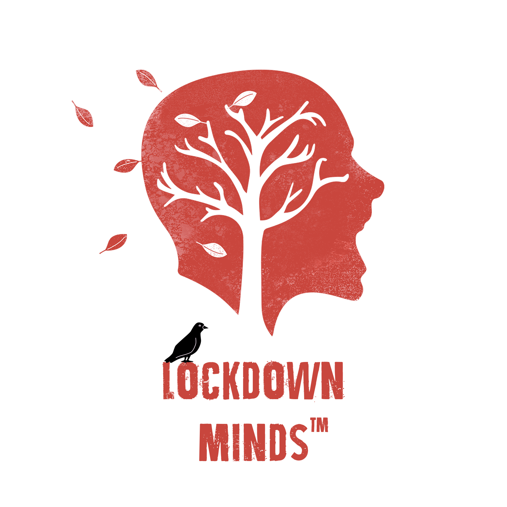
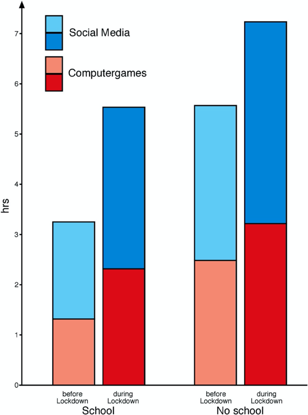

<h1 align="center">

 
DistractAbility
</h1>

<h4 align="center">A distraction-infested memory game to highlight the problem that many people have experienced heightened attentional difficulties since the onset of the Coronavirus pandemic.</h4>

  

# Team
<table style="width:100%">
    <tr>
        <td>

</td>
        <td>

</td>
        <td>

</td>
        <td>

</td>
        <td>

</td>
    </tr>
    <tr>
        <td colspan="1">
Alan (Backend)
</td>
        <td colspan="1">
Efan (Backend)
</td>
        <td colspan="1">
Joshua (Frontend)
</td>
        <td colspan="1">
Ella (Frontend)
</td>
        <td colspan="1">
Keane (DevOps)
</td>
    </tr>
</table>

# Introduction
## Abstract
&nbsp;&nbsp; In this project we propose **DistractAbility**, a single page application designed to highlight the problem of the deleterious effects of lockdown and general coronavirus restrictions on people’s attentional abilities, and the negative consequences entailed by this increased susceptibility to distraction, for instance on people's quality of work or study. To highlight this important issue in a way that is fun and interactive, we have designed a brain-training game with a twist. The user of our application plays two rounds of a simple brain training task, each round within a time limit of two minutes. The first round is played without distraction while the second round is permeated with increasing levels of distracting stimuli, making it harder to successfully complete the task. At the end, the user is shown their scores for each round. If the presence of distractions affected the user's ability to focus on correctly completing the mind games, the second score can be expected to be lower than the first.

## Repository Structure
## Project Objectives
## Objectives
## Video

# Background and Motivation

## Literature Review

&nbsp;&nbsp; In this literature review, we will first cover the field related to the problem of greater attentional difficulties in the context of COVID-19. We will then review the literature on serious play and outline the kind of play that we believe best fits our project.

## Literature Review: The Problem 

### Context ###

&nbsp;&nbsp; By December 2019, the outbreak of a SARS-associated coronavirus (designated  COVID‐19, short for coronavirus 2019) had spread from Wuhan, China across the globe and was declared a pandemic by the World Health Organization (WHO) in March 2020 (WHO, 2020; Ghebreyesus, 2020). In that month nineteen European countries entered national lockdowns, most of which remained in place for several months (Hirsch, 2021). As is now common experience, these lockdowns entailed closure of schools, universities and all non-essential shops and services; employees were advised to work from home (WFH) wherever possible, with many of those unable to WFH put on temporary income schemes such as the British Furlough scheme or out of work entirely. Most countries also saw a ban on all non-essential movement (Hirsch, 2021). All of a sudden countless individuals had to quickly adapt to entirely new ways of working or studying remotely and juggle this with childcare, personal relationships, household chores, and family demands in general. This was experienced in the context of personal loss or the constant possibility of loss or ill-health, difficulty accessing standard medical care, extreme social isolation, job insecurity and joblessness, economic hardship, and heightened global social injustices and social unrest. We can surely expect that people have found it more difficult to concentrate in these unprecedented times. 

&nbsp;&nbsp; In this literature review we investigate two major questions. First, has the pandemic impacted people’s attention? Here we distinguish between (i) people feeling and believing that their attentional abilities have worsened since the onset of the pandemic, and (ii) the actual impact on people’s attentional abilities, which we measure in terms of productivity. The second question we ask is why many people have suffered increased distractibility in the context of COVID-19 and resultant restrictions? Here we make a distinction between change and continuity: we categorise as ‘change’ novel forces affecting people’s attention that exist as a direct result of the pandemic; and we categorise as ‘continuity’ factors which the pandemic may have worsened, but that nonetheless existed prior to and independently of COVID-19. Both questions are asked in order to inform the design of our application. 

### Methodology ###

&nbsp;&nbsp; We review a host of academic papers published in reputable journals, but we also review non-academic articles, columns and opinion pieces published in popular newspapers such as the New York Times and blog pages. We justify our decision to do so on account of two salient factors. First, the brief timeline of events necessitates that we review some relatively informal sources simply to gather enough evidence. Our application is meant to highlight the impacts of the increase in concentration difficulties since the onset of COVID-19, and since the WHO only declared it a pandemic in March 2020, the non-academic sources referenced herein contain strong anecdotal evidence for greater attentional difficulties that simply has not made its way into academic literature by the time of writing this report. Second, lockdown-induced attentional difficulties evidently have both quantitative and qualitative negative implications and it is important to account for both – hence we are investigating both whether people feel more distracted and the actual impact of distraction. While academic literature is arguably the most authoritative kind of source when it comes to quantifying the effect of lockdown on, for example, the productivity of WFH, at the present moment non-academic sources seem to be richer in personal testimonies of how individuals have been experiencing severe distractibility and “feeling scatterbrained” (Purtill, 2020). In short, if people are experiencing attentional difficulties specifically related to lockdown measures then their testimony is sufficient evidence of a problem. 

### Has COVID-19 and the resultant restrictions impacted people’s concentration? ###

&nbsp;&nbsp; From the literature, it is clear that many people feel more distracted and believe their attentional abilities have diminished since the onset of the pandemic. But since it is always possible for individuals to develop a negative view of themselves and their abilities which does not reflect reality, we also quantify the actual impact of the pandemic on people’s attention. The proper, reliable way of assessing the actual impact would be to have conducted mass psychometric testing before and after the onset of the pandemic. We were not able to find any examples in the literature of such a study being conducted, so we have chosen productivity as our metric for assessing the actual impact of people’s perceived attentional difficulties. We found sufficient evidence to conclude that, for many, perceived attentional difficulties have translated into reduced productivity. This finding informed the design of our application in two major ways. First, the user’s scores for each of the two rounds are presented to the user side-by-side at the end of the second round only, in order to highlight the contrast between their score without distraction and their score with distraction – the latter of which can be expected to be lower if the distractions affected their ability to complete the game. Secondly, the evidence that this finding holds for a large number of people led us to build statistics into our application; now the user is able to compare their scores to the average scores of other users.

**People believe they are more easily distracted**

&nbsp;&nbsp; From February to March of 2020 there was a three-hundred per cent increase in people searching “how to get your brain to focus”, a one-hundred per cent increase in “how to focus better”, and a sixty per cent rise in “how to increase focus” (Manavis, 2020). In response to a recent survey by S&P Global Market Intelligence, fifty-five per cent of respondents reported feeling both less productive and less engaged when WFH (Lawson, 2020). Penn Medicine, The Irish Times, and professional psychiatrists such as Jessi Gold, M.D., M.S. have all noted the phenomenon of “pandemic brain fog” (Messinger, 2020; Keogh, 2020; Gold et al, 2020). Meanwhile columns and opinion pieces in The New York Times abound with examples of people feeling uncharacteristically “scatterbrained,” citing the stressors of the pandemic and working from home as the cause of their disrupted attention, memory, breathing and sleeping (Purtill, 2020). 

&nbsp;&nbsp; There is, however, some opposition to the mainstream view that coronavirus and the resultant restrictions have negatively impacted people’s attention. For instance, Mattern, Lansmann and Hüllmann conducted a four-week diary study in April and May 2020 with 37 participants from a German university in an attempt to examine whether enforced working from home (EWFH) due to COVID-19 increases perceived stress levels or causes a feeling of communication overloaded – both factors that other sources in the literature cite as causes of perceived attentional difficulties (Mattern, 2021). Their data suggested that EWFH does not increase participants’ stress levels nor does it cause communication overloaded. 

&nbsp;&nbsp; Nonetheless, there are numerous flaws in the methodology used by Mattern, Lansmann and Hüllmann that arguably make this an unreliable source for assessing the extent to which people have generally experienced difficultly directing and/or sustaining attention in the context of national lockdowns and other coronavirus restrictions. First, the sample group is hardly representative. The authors recruited study participants via a mailing list comprising staff members – but not students – of the business and economics faculty at one, single German university. As far as we can tell from the paper, the study sample was not controlled for any of the following categories: age, ethnicity, orientation, gender identification, income threshold, educational background,  whether they lived in urban or rural dwellings, nor whether they had school-age children or other caring responsibilities. The nature of these participants’ work is also likely to be very similar, given that all participants were recruited from the same faculty. Overall, the unrepresentativeness of the study sample is arguably so pronounced that the data can already be viewed as a wholly unreliable indication of the extent to which people across the world have experienced heightened attentional difficulties compared with pre-pandemic circumstances. 

&nbsp;&nbsp; There are additional reasons not to assume that the data represents swathes of the global population not beset by increased difficulties in concentrating. Note that the study was conducted between April and May of 2020. As will be expanded upon in the following section, Forbes found that the first few months of the pandemic saw the phenomenon of “panic productivity” which Forbes and analysts at S&P Global Market Intelligence all found “evaporating” as the pandemic wore on (Brower, 2021; Lawson, 2020). It is thus reasonable to speculate that the study participants’ perceived stress and feelings of communication overload may have increased alongside the global trend since the conclusion of the diary study. Clearly, there is ample evidence demonstrating the extent to which many individuals believe their attentional abilities have diminished since the onset of the pandemic. But how far have these perceived difficulties actually impacted people?

**Impact of attentional difficulties on productivity**

&nbsp;&nbsp; One might assume that people working or studying from home would be more productive, without factors such as a tiring commute or the need to move between different locations for meetings, lectures and the like during the working day. Indeed, much of the literature claims the world of work has been “revolutionised”  by the pandemic in light of skyrocketing productivity since employees began WFH (Waters, 2020). On the other hand, the Bank of England’s chief economist, Andy Haldane, says there is no evidence that WFH has boosted productivity in the United Kingdom nor that it will do in the long run (Elliot, 2020). The literature is truly divided and it is astonishing how apparently contradictory the statistics are. Thankfully, a recent Forbes analysis of productivity reports since the onset of the pandemic brings clarity: overall and by this point in the pandemic productivity is negatively impacted by WFH in the context of COVID-19. We will now briefly review the literature in support of increased productivity, then we will use Forbes’ report to explain why such reports are generally misleading and provide evidence for decreased productivity. 

&nbsp;&nbsp; Numerous sources report that productivity has increased since employees started WFH due to coronavirus restrictions. A report by Deloitte, for which research was conducted between 14th – 19th May 2020, found that fifty-five per cent of workers believed their colleagues were at least, if not more, productive by May 2020 than before the first national lockdown in the UK (Deloitte, 2020). We can trust the reliability of this study: Participants were recruited from a nationally representative quota sample of 2,213 UK adults, filtered to a sample of 1,321 workers aged 16-75; and the data were weighted to the known offline population proportions for age within gender, employment status and social grade as well as government office region. However, the findings of this report concern people’s opinions of their colleagues’ productivity – opinions which may be inaccurate, especially at a time when these very people are isolated from their colleagues. Note also that the data was collected in May 2020 – relatively early on in the pandemic. 

&nbsp;&nbsp; A survey of 996 employers based in Great Britain and Western Europe, conducted by Willis Towers Watson in April 2020, found no significant change in employee productivity since the onset of the pandemic (Franklin, 2020). Similarly though to the Deloitte report, this survey was conducted in April 2020. As we shall now go on to explain, Forbes finds that these early reports of increased or stable productivity explained the initial spike in productivity that was short-lived as the pandemic wore on.

**Productivity is down**

&nbsp;&nbsp; In January 2021, Forbes published their analysis of productivity reports since the onset of the pandemic (Brower, 2021). It was found that many of the reports of increased productivity were early in the pandemic and can be seen as evidence of initial “panic productivity” that quickly faded as the duration of the pandemic grew. Analysts at S&P Global Market Intelligence concur that by September 2020,  early productivity gains were already “evaporating” (Lawson, 2020). 

&nbsp;&nbsp; Furthermore, many of the productivity reports were themselves flawed in their methodology. For instance, productivity is meant to be a measure of how much people get done in a period of time, but Forbes points out that many of the early WFH productivity reports did not account for the increased hours people were working. In the United States, for example, the average workday for many companies grew by three hours once lockdown measures were introduced (Brower, 2021; McKeever, 2020). Presumably many employees worked extra hours to make up for what they perceived as time lost to unproductivity, and potentially due to distraction. Forbes cites the proximity of work to home as a contributing factor to hampered productivity. Moreover, time spent doing things that would not previously have counted as ‘work’ are now counting towards productivity metrics. For instance, most employee communication has tended to take place over Zoom or Teams since coronavirus restrictions began, and since many companies log total employee Zoom hours as ‘work’, the early reports of increased productivity tended to include any and all inter-colleague communication in their sum of what counted as ‘work’. Previously such communication was much less likely to be logged as ‘work’ given that it often took place more informally or spontaneously, such as a face-to-face chat before a meeting. 

&nbsp;&nbsp; Forbes also identified a flaw in the early productivity reports insofar as many did not control for the nature of the work being done. In terms of the complexity of the work, a recent study demonstrated that people might be more productive on rote, routine or repetitive work, but less so on work that was complex, urgent or required problem solving. People’s ability to complete administrative responsibilities may not have been hampered, but their productivity for work that required greater sophistication did take a hit. People were also less productive than pre-pandemic when their tasks involved collaboration, co-creation or generative work – as Forbes notes, just consider the mantra of 2020, “You’re on mute.”

&nbsp;&nbsp; Overall, Forbes’ findings explain why the early reports of increased productivity are not a reliable indication of whether productivity has been negatively impacted since the onset of the pandemic. Similarly, as early as May 2020, the Office for National Statistics warned that the pandemic poses significant challenges in accurately measuring productivity; these include a range of issues affecting output and input data, and statistical issues such as seasonal adjustment of time series data (Newman et al, 2020). Between the summer of 2020 and the present moment (April 2021) the consensus in the literature has been that productivity is down since the onset of the pandemic.

&nbsp;&nbsp; Researchers at The Australian National University (ANU) reveal that Australians have lost 167 hours' worth of work between March and October due to the pandemic. This equates to over $5,000 each, and $47 billion for the economy as a whole (Biddle & Gray, 2020). In December 2020 the National Bureau of Economic Research (NBER) published their analysis of the impact of Covid-19 on productivity in the United Kingdom (Bloom et al, 2020). The authors found that the pandemic reduced total factor productivity (TFP) in the private sector by approximately 5% in 2020 Q4. The authors also predict a 1% reduction in TFP the medium term and additional long-term negative impacts of the pandemic on productivity. Their report was later published by the Bank of England (Bloom et al, 2020, BoE). Then in early 2021, McKinsey found that the pandemic had a generally negative impact on short-term accumulation of physical capital, which they see as a crucial element that typically drives growth in productivity (Mischke et al, 2021).

&nbsp;&nbsp; Admittedly, correlation is not necessarily causation. People may feel that their attention has been negatively impacted by the pandemic while their reduced productivity is due to other factors, for instance, insufficient technical infrastructure to WFH to the same standard as when they worked out of the house. Still, the trend is sufficiently pronounced for us to conclude that, at least for many, perceived attentional difficulties brought on by the Coronavirus pandemic does have real, negative implications on their productivity. In fact, research by Russo et al, which examined the predictors of wellbeing and productivity due to governmental coronavirus restrictions on workplaces, then found that boredom and distractions were related to lower productivity (Russo et al, 2021). This study was comprehensive; it was a longitudinal study, meaning the authors collected initial data and then returned at a later date to obtain comparison data. A complimentary study by Ralph et al, which surveyed over 2,000 software developers from across the world, found not only that the pandemic has had a negative effect on both wellbeing and productivity, but importantly, that the two areas of productivity and wellbeing were closely related (Ralph et al, 2020). Ralph et al also found that that women were expected to devote more time to housework and childcare than men during lockdown. This finding is supported by Feng & Savani’s study of gender differences on perceived productivity and job satisfaction for couples where both parents worked and had been forced to remote-work since the start of the pandemic; the authors found no significant differences in perceptions prior to lockdown, but after lockdown women reported lower levels of perceived productivity and job satisfaction (Feng & Savani, 2020). A report by Tap’d Solutions similarly found that fear of the pandemic and home ergonomics were correlated to lower wellbeing and productivity and that the demographic groups of women, parents and disabled workers may be disproportionately affected by recent work changes (Tap’d, 2020).

**Relevance to our application**

&nbsp;&nbsp; The evidence in the literature that many individuals feel less able to focus in the context of the Coronavirus pandemic, and that this has negatively impacted people’s productivity, is undoubtedly a serious problem with globally significant implications for the worldwide economy and citizen wellbeing. As mentioned, this has informed the design of our application in two major ways. 

&nbsp;&nbsp; First, the structure of our application. We believe that the implications of greater distractibility for stress levels and general wellbeing will be reflected in the user’s experience of playing the game with built-in distractions. But to highlight the actual impact of distraction on productivity, above and beyond the unpleasant feelings associated with attentional difficulties, we have designed the game such that the user plays two rounds of a brain training task, the first without any distractions and the second with engineered distractions. The user’s scores for the two rounds are presented to them only at the end of the second round, and are presented side-by-side, to highlight the actual impact of greater distractibility on productivity. Given the evidence in the literature that greater distractibility in the context of COVID-19 has had real, negative consequences for people’s productivity, if our application is well-designed the average user’s score for the second round can be expected to be lower than their score for the first round. 

&nbsp;&nbsp;  Second, the evidence in the literature that this problem is widespread lead us to build statistics into our application. The user is able to compare their scores for each round against the average score for each round of all other users of our application. Hopefully this will impress upon the user how consequential distractions really are for work or study. 

### Why are people finding it harder to focus? ### 

&nbsp;&nbsp; It is clear from the literature reviewed above that people have generally found it harder to direct and/or sustain attention in the context of the Coronavirus pandemic and resultant restrictions. Here we examine the possible causes of these heightened attentional difficulties, with the aim of making the distractions present in the second round of our application as relevant as possible. 

&nbsp;&nbsp; There are two main themes in the literature that seeks to explain why people have found it harder to focus since the onset of the pandemic. We have categorised these themes as change and continuity; ‘change’ being the novel forces affecting people’s attention that exist as a direct result of the pandemic, and ‘continuity’ being factors which the pandemic may have worsened, but that nonetheless existed prior to and independently of COVID-19.

**Background**

*Attention is a limited cognitive resource*

&nbsp;&nbsp; Cognitive psychologist and Nobel Prize winner Daniel Kahneman was among the first to propose that attention is a limited cognitive resource and that some cognitive processes require more attention than others (Kahneman, 1973). This is particularly the case for activities involving conscious control of cognitive processes, such as reading or writing academic papers, which involve attention and mental energy – what Kahneman calls “System 2” thinking. The idea that attention is a finite capacity is also at the centre of theories proposing that conscious and controlled cognitive processes are carried out in working memory, which is thought to only be capable of processing a limited about of new information (Baddeley, 2012). In working memory, attention is thought to be like the adjudicator of cognitive resource allocation and action execution. 

*Emotion and attention*

&nbsp;&nbsp; Professor Beatrice Pudelko of TÉLUQ University uses neuroscience to explain why the pandemic has exerted such pressure on our attentional capacities. Pudelko explains that the amygdala is a region in the brain that is rapidly activated in the face of threatening stimuli (Pudelko, 2020). In humans, the amygdala activates quickly and automatically in response to social stimuli loaded with negative emotions, causing emotionally-charged changes to our perceptions that we are highly sensitive to and unable to ignore (Compton, 2003). Evidence implies that the networks connecting the amygdala and the prefrontal cortex, where working memory happens, play an important role in discriminating between relevant and irrelevant information for the activity at hand (Pessoa & Adolphs, 2010). For instance, emotional stimuli were found to interfere with tasks involving working memory, and the greater the cognitive load associated with the task, the greater the impact on working memory of the same emotional stimuli (Lavie, 2005). Research on anxiety by Michael Eysenck et al similarly demonstrated that when people are anxious, they prefer to focus their attention on stimuli associated with the threat and unrelated to the task at hand, regardless of whether the stimuli are internal or external (Eysenck et al, 2007). There has also been research showing that feelings of mental fatigue increase when the subject is performing a task while trying not to respond to outside demands. Some have even suggested that mental fatigue is a particular emotion that both tells us our mental resources are being depleted, and in turn acts as a negative emotional stimuli affecting concentration in itself (Kurzban et al, 2013). Evidently, negative emotional stimuli, especially anxiety-producing stimuli, wreak havoc with our attention and ability to complete tasks that require the use of working memory.

**Change**

&nbsp;&nbsp; In light of the research demonstrating the impact of negative emotional stimuli on cognition, it is hardly surprising that in the context of 24-hour news coverage of the dangers of the pandemic, the ever-rising death toll and job and economic insecurity, employees and students alike are struggling to direct and sustain attention on their work. Indeed, Penn Medicine reported that stress from the pandemic can cause one’s emotions to become overblown and in turn reduce the effectiveness with which the parts of the brain in charge of executive functioning communicate with the parts of the brain that regulate emotion, making it harder to concentrate (Messinger, 2020). 

&nbsp;&nbsp; Similarly, the Irish Times similarly found that brain “fog” is a big part of the pandemic experience for many. The Irish Times attributes this to the finding that, since the start of the pandemic, 39 per cent of Irish workers are struggling with everyday life, over 90 per cent are experiencing a rise in anxiety levels, 30 per cent are suffering from loneliness and isolation, and one in 10 have sought help for mental wellbeing issues (Keogh, 2020). To explain the link between the negative emotional stimuli provided by COVID-19 and attention, the Irish Times interviewed Dr Christian Jarrett, psychologist and deputy editor of Psyche magazine. Dr Jarrett concurs with the literature reviewed in the ‘Background’ section of this report that attention is a finite resource: “When we’re working on a problem, especially an unfamiliar one, we depend on our working memory, which is very limited.” The extreme novelty of Coronavirus and the resultant restrictions means we can draw less on our stored experience and instead must draw on our limited capacity for working memory. Essentially the intrinsic cognitive load of much of what we do has increased. Moreover, concurring with the literature on the implications of negative emotional stimuli on information processing, Dr Jarrett says, “What’s happening now is that disruptions to life caused by the pandemic are forcing you to draw on your limited working memory capacity more often, at a time when – if you’re more stressed and your anxiety levels are raised or you’re juggling multiple tasks and commitments – you have diminished working memory capacity. It’s the worst of both worlds and another reason why you’re feeling mentally drained.”

&nbsp;&nbsp; Dr Amy Arnsten, a Professor of Neuroscience and a Professor of Psychology at Yale University, also concurs with the theory that negative emotional stimuli disrupt attention (Arnsten, 2020). Arnsten explains that, in the face of immediate danger, the prefrontal cortex – integral to working memory and the ability to focus – essentially shuts down to make way for the more primitive parts of the brain that can respond quickly. The pandemic presents us with danger that is ongoing but not acute, meaning we cannot deal with the immediate danger and move on. Instead, we are cutting off the part of our brain that helps us think beyond the primitive for extended periods of time – and this affects our concentration. In fact, Arnsten says that even ambiently knowing that the situation is not improving can lead to an inability to focus as well as an overall lack of motivation. Arnsten explains that an often forgotten part of our flight or fight response to danger is to “freeze”, which can feel a lot like mental paralysis. According to Arnsten, “losing the ability to have really motivated, guided behaviour can be linked to all these primitive reflexes.” 

&nbsp;&nbsp; In summary, one major drain on attentional capacities – one that we categorise as ‘change’ – is the torrent of negative emotional stimuli associated with the Coronavirus pandemic. To reflect this in our application, we use an API to pull in current news articles with which we populate the screen during the second round, while the user is attempting to complete the task.

**Continuity**

&nbsp;&nbsp; We categorise as ‘continuity’ things that inhibit our attention that the pandemic may have made more pronounced in our lives, but which were nonetheless features of modern life before the outbreak of Coronavirus. According to the literature, the three major, pre-existing forces acting on our attention are social media, media multitasking, and inactivity.

*Social media and streaming services*

&nbsp;&nbsp; The negative impacts of social media and streaming services on attention have been well-documented. Research shows that digital devices physically stimulate the human brain in the same way as drugs such as cocaine and heroin (Selwyn & Aagaard, 2020). Receiving a “Like” on Facebook apparently triggers a burst of dopamine – a kind of chemical reward in the brain. These intense jolts of dopamine are thought to rewire our brains over time and establish reward‐driven “seeking” behaviours that prompt repetitive use of social media and digital devices at the expense of attentional capacity. In support of this theory, Kirschner and Karpinski found a negative association between Facebook use and grade-point-average (GPA) (Kirschner & Karpinski, 2010). Feng et al then found that high‐frequency users of Facebook for entertainment purposes are associated with higher distraction rates as well as lower GPAs (Feng et al, 2019). Additionally, Facebook use was found to be increasingly detrimental to academic performance and attention as usage expands, regardless of what Facebook is used for.

&nbsp;&nbsp; The restrictions introduced to slow the spread of Coronavirus have undoubtedly increased the influence of social media and streaming services in the daily lives of people of all ages and walks of life. Globally, Netflix saw 15.8 million new subscribers in the first quarter of 2020, and daytime streaming rose 4 per cent between March and April. It is of note that on March 20th 2020, Netflix and YouTube were asked by the European commission to decrease the rate of data transfer through their in order to prevent the breakdown of the internet. According to BBC News, the use of video streaming services increased by 71% compared to 2019. Social media usage also exploded as people lost countless hours to ‘doomscrolling’ – mindlessly refreshing feeds in search of new information about the pandemic or politics. And it was not just adults, newly WFH, whose screentime increased. One German study revealed that during the first lockdown in spring 2020, children and adolescents aged 10 - 17 increased their daily screen time spent playing computer games and using social media from about four to seven hours (Spitzer, 2021). They additionally spent more time watching videos and using streaming services such as Netflix (see Figure 1 below).

<td>

</td>

*Fig. 1: This bar chart displays the average daily use (in house) of computer games (red) and social media (blue) by children and adolescents in September 2019 (before lockdown; lighter colours) and April 2020 (during lockdown; darker colours) on school days (left) and days with no school (weekends, holidays, lockdown; right). Source: Spitzer, 2021.*

&nbsp;&nbsp; Interestingly, the pandemic seems not only to have increased the frequency of people’s use of social media and streaming services, but also the potency of the attraction, i.e. the pull on people’s attention. In Shirking from Home, interviewee Rosen admits that in the context of our unprecedented social isolation, “When you get a [notification] from someone that says they’re following you on Instagram, when you crave connection, you immediately go there,” Rosen says (Cummins, 2020).

&nbsp;&nbsp; On account of the heightened extent to which social media has proved a distraction in the context of the pandemic, we have built sound into our application. In the second round the user will hear social media notification sounds as they attempt to complete the brain training task.  

*Media Multitasking*

&nbsp;&nbsp; Media multitasking may be described as using two or more forms of electronic media simultaneously, or simply the use of electronic media with other forms of nonmedia (Ziegler et al, 2015). Many assume that with enough exposure and diligence, people can eventually become effective media multitaskers, but this assumption is hotly disputed in academia. In the early 2000s, Prensky published a ground-breaking paper in which he introduced the term “digital natives” to refer to the generations who have grown up immersed in technology from a young age, as opposed to “digital immigrants” who were largely born before the advent of the internet (Prensky, 2001). Prensky argued that “digital natives” can effectively media multitask due to early habituation to many different media technologies. Kirschner and Bruyckere are among the many critics who argue that Prensky’s view is a fallacy (Kirschner & Bruyckere, 2017). Researchers in Kirschner and Bruyckere’s camp contend that there is no performance benefit to multitasking as there are significant cognitive demands to switching between tasks regardless of technological immersion. Carrier et al also found that both learning and academic performance measured by GPA are negatively impacted by media multitasking (Carrier et al, 2015).

&nbsp;&nbsp; Prensky’s paper was published in 2001, before the invention of Facebook, Instagram or Twitter in 2004, 2006 and 2010 respectively. In a more recent study of media multitasking, researchers divided students into three groups and asked them to read a passage. One group had no distractions, one group received an instant message before they started reading, and a third group received instant messages as they read. When tested on the material, each group fared equally well, but the third group took the longest to complete the task (Bowman et al, 2010). More recently still, researchers found that device‐based “multitasking” correlates with significant declines in academic performance (Chen & Yan, 2016). There is much more evidence in the literature demonstrating the deleterious effects of media-multitasking on attention, but perhaps most concerning is the finding that, despite the evidence, many people have a “significant sense of overconfidence” in their ability to media multitask effectively (Kirschner & Bruyckere, 2017). Was et al similarly found that students are often unaware of the detrimental effects of media multitasking (Was et al, 2019). Evidently, media multitasking is often detrimental to attention. 

&nbsp;&nbsp; Many individuals often media multitasked prior to the pandemic, but COVID-19 and social distancing has undeniably exacerbated the practice. For instance, previously a student would have turned up to a lecture and when it was time for questions the speaker would pause, take questions, and then resume lecturing once questions had been asked and answered. In the current situation of remote learning these things tend to happen concurrently rather than consecutively. Now, with lectures taking place via Microsoft Teams, it is common for the lecturer to continue speaking all the while there is a constant string of notifications as students post their questions to the chat box and teaching assistants answer them while the main lecture continues full speed ahead. This is a form of media multitasking. Given the evidence above, it is reasonable to conclude that one of the reasons people have found it harder to focus in the context of the present situation is that the pandemic has intensified the already-problematic phenomenon of media multitasking. 

&nbsp;&nbsp; There is a larger volume of literature in the ‘continuity’ camp, however, this is likely for the simple reason that these forces on our attention have existed and been studied for years while COVID-19 is only a year old. Overall it is fair to say that the factors for change and continuity have both had a significant impact on our attention, both individually and in tandem – for instance, using social media to ‘doomscroll’ for news about the pandemic. We have thus included in our application a fairly equal weighting of distractions associated with 'change', i.e. pulling in news from an API, and those associated with 'continuity', such as social media notification sound effects and *Tiger King* sound bites.

*Inactivity*

&nbsp;&nbsp; Finally, there is much in the literature about how physical activity improves concentration (Cooper, 2021; *Harvard Medical School*, 2021). It therefore stands to reason that with gyms closed and people stuck in their homes for months on end, the increase in physical inactivity has presumably also contributed to widespread attentional difficulties since the onset of the pandemic.  

**Relevance for our application**

&nbsp;&nbsp; In summary, to represent the implications of negative emotional stimuli connected to the pandemic, we use an API to pull in current affairs articles and have these moving about the screen while the user is attempting to complete the task at hand. We also try to distract the user by playing the BBC News theme song. To represent the influence of social media and streaming services on attention, throughout the second round of the game we play social media notification sounds and sound clips from TV series such as *Tiger King*, which were popular during the lockdown period.  We seek to reflect the impact on concentration of media multitasking by playing the notification sounds of common workplace media, such as the incoming video-chat ringtone for Microsoft Teams. Finally, we believe that inactivity is best exemplified by the fact that the user is presumably sitting down, or at least fairly sedentary, while using our application.

## Literature Review: Serious Play

### Bibliography: The Problem

**Primary Sources**

&nbsp; J. Alexander, "Netflix adds 15 million subscribers as people stream more than ever, but warns about tough road ahead", The Verge, 2020. [Online]. Available: https://www.theverge.com/2020/4/21/21229587/netflix-earnings-coronavirus-pandemic-streaming-entertainment. [Accessed: 11- Apr- 2021].

&nbsp; D. Arnsten, Ph.D., The Brain's Response to Stress - How Our Brains May Be Altered During the COVID-19 Pandemic. Yale School Of Medicine, 2020. Available: https://www.youtube.com/watch?v=TsQUeNuvIDY. [Accessed 15 April 2021].

&nbsp; N. Biddle and M. Gray, "Tracking outcomes during the COVID-19 pandemic (October 2020) – Reconvergence", ANU Centre for Social Research and Methods, pp. 1-15, 2020. Available: https://csrm.cass.anu.edu.au/sites/default/files/docs/2020/11/Tracking_wellbeing_outcomes_during_the_COVID-19_pandemic_October_2020_PDF.pdf. [Accessed 14 April 2021].

&nbsp; N. Bloom, P. Bunn, P. Mizen, P. Smietanka and G. Thwaites, "The Impact of COVID-19 on Productivity", NBER Working Paper Series, December 2020. Available: https://www.nber.org/system/files/working_papers/w28233/revisions/w28233.rev0.pdf. [Accessed 14 April 2021].

&nbsp; N. Bloom et al, "Staff Working Paper No. 900", Bank of England, 2020. Available: https://www.citethisforme.com/ [Accessed 14 April 2021].

&nbsp; L. Bowman, L. Levine, B. Waite and M. Gendron, "Can students really multitask? An experimental study of instant messaging while reading", Computers & Education, vol. 54, no. 4, pp. 927-931, 2010. D.O.I: 10.1016/j.compedu.2009.09.024 [Accessed 15 April 2021].

&nbsp; T. Brower, "Think Productivity With Work From Home Is Improving? Think Again. Here’s What You Must Know", Forbes, 2021. Available: https://www.forbes.com/sites/tracybrower/2021/01/17/think-productivity-with-work-from-home-is-improving-think-again-heres-what-you-must-know/?sh=162ef3ab2d67 [Accessed: 11- Apr- 2021].

&nbsp; M. Brückle, “Because of Corona, Netflix and YouTube decrease image quality in order to ease the load on communication networks” (2020) Available: https://www.buffed.de/Netflix-Firma-259629/News/Streaming-Qualitaet-Corona-1345982/. [Accessed: 11- Apr- 2021].

&nbsp; L. Carrier, L. Rosen, N. Cheever and A. Lim, "Causes, effects, and practicalities of everyday multitasking", Developmental Review, vol. 35, pp. 64-78, 2015. D.O.I: 10.1016/j.dr.2014.12.005 [Accessed 15 April 2021].

&nbsp; Q. Chen and Z. Yan, "Does multitasking with mobile phones affect learning? A review", Computers in Human Behavior, vol. 54, pp. 34-42, 2016. Available: www.sciencedirect.com/science/article/abs/pii/S0747563215300595#:~:text=Studies%20conducted%20in%20the%20laboratory,Carrillo%20%26%20Subrahmanyam%2C%202014. [Accessed 15 April 2021].

&nbsp; S. Cooper, "Physical activity is good for your concentration – here’s why", The Conversation, 2021. Available: https://theconversation.com/physical-activity-is-good-for-your-concentration-heres-why-151143. [Accessed: 15- Apr- 2021].

&nbsp; E. Cummins, "Shirking from home", Vox, 2020. Available: https://www.vox.com/the-highlight/21317485/work-from-home-coronavirus-covid-19-zoom-distraction-animal-crossing [Accessed: 15- Apr- 2021].

&nbsp; Deloitte, "Working during lockdown: The impact of COVID-19 on productivity and wellbeing", Deloitte United Kingdom, 2020. [Online]. Available: https://www2.deloitte.com/uk/en/pages/consulting/articles/working-during-lockdown-impact-of-covid-19-on-productivity-and-wellbeing.html. [Accessed: 13- Apr- 2021].

&nbsp; L. Elliot, "Working from home is proving to be a revolution in our way of life", The. Guardian, 2020. Available: https://www.theguardian.com/business/2020/oct/26/working-from-home-is-proving-to-be-a-revolution-in-our-way-of-life [Accessed:  13- Apr- 2021].

&nbsp; S. Feng, Y. Wong, L. Wong and L. Hossain, "The Internet and Facebook Usage on Academic Distraction of College Students", Computers & Education, vol. 134, pp. 41-49, 2019. D.O.I: 10.1016/j.compedu.2019.02.005 [Accessed 15 April 2021].

&nbsp; Z. Feng and K. Savani, "Covid-19 created a gender gap in perceived work productivity and job satisfaction: implications for dual-career parents working from home", Emerald Insight: Gender Management, 7 September, 2020. ISSN: 1754-2413. Available: https://www.emerald.com/insight/content/doi/10.1108/GM-07-2020-0202/full/html. [Accessed 14 April 2021].

&nbsp; N. Franklin, "Employee productivity proves remarkably resilient during pandemic", Insight., 2020. Available: https://workplaceinsight.net/employee-productivity-proves-remarkably-resilient-during-pandemic/ [Accessed: 14- Apr- 2021].

&nbsp; J. Gold, M.D., M.S., "The ‘Covid Cloud’ Is Real", 2020. [Online]. Available: https://www.instyle.com/lifestyle/covid-cloud-concentration-memory-issues. [Accessed: 11- Apr- 2021].

&nbsp; O. Keogh, "Pandemic-induced ‘brain fog’ is result of cognitive overload", The Irish Times, 2020. Available: https://www.irishtimes.com/business/work/pandemic-induced-brain-fog-is-result-of-cognitive-overload-1.4436434 [Accessed: 11-Apr-2021].

&nbsp; P. Kirschner and P. De Bruyckere, "The myths of the digital native and the multitasker", Teaching and Teacher Education, vol. 67, pp. 135-142, 2017. D.O.I: 10.1016/j.tate.2017.06.001 [Accessed 15 April 2021].

&nbsp; P. Kirschner and A. Karpinski, "Facebook® and academic performance", Computers in Human Behavior, vol. 26, no. 6, pp. 1237-1245, 2010. D.O.I: 10.1016/j.chb.2010.03.024 [Accessed 15 April 2021].

&nbsp; S. Künn, C. Seel and D. Zegners, "Cognitive performance in the home office—What professional chess can tell us", IZA World of Labor, 2020. Available: https://wol.iza.org/opinions/cognitive-performance-in-the-home-office?utm_source=Adestra&utm_medium=email&utm_content=Cognitive%20performance%20in%20the%20home%20office%E2%80%94What%20professional%20chess%20can%20tell%20us&utm_campaign=IZA%20WoL%20Sept%20monthly%20newsletter [Accessed: 11- Apr- 2021].

&nbsp; T. Lawson, "Work-from-home productivity gains seen evaporating as pandemic grinds on", S&P Global Market Intelligence, 2020. Available: https://www.spglobal.com/marketintelligence/en/news-insights/latest-news-headlines/work-from-home-productivity-gains-seen-evaporating-as-pandemic-grinds-on-60119373 [Accessed: 11- Apr- 2021].

&nbsp; J. Mattern, S. Lansmann and J. Hüllmann, "It’s not that bad! Perceived stress of knowledge workers during enforced working from home due to COVID-19", 16th International Conference on Wirtschaftsinformatik, 2021. [Online]. Available: https://www.joschka-huellmann.net/publications/2020-12-22-draft-COVID-19-and-stress_camera-ready.pdf. [Accessed: 12- Apr- 2021].

&nbsp; S. Manavis, "Why can’t we focus during this pandemic?", New Statesman, 2020. Available: https://www.newstatesman.com/science-tech/coronavirus/2020/05/how-focus-concentration-pandemic-brain-motivation-apps-pomodoro [Accessed: 11-Apr-2021].

&nbsp; V. McKeever, "Coronavirus lockdowns are making the working day longer for many", CNBC: Make It, 2020. [Online]. Available: https://www.cnbc.com/2020/03/30/coronavirus-lockdowns-are-making-the-working-day-longer-for-many.html. [Accessed: 11- Apr- 2021].

&nbsp; H. Messinger, "Coping with COVID Stress: From Pandemic Brain Fog to Building (and Studying) Resilience", Penn Medicine News, 2020. Available: https://www.pennmedicine.org/news/news-blog/2020/june/coping-with-covid-stress [Accessed: 11-Apr-2021].

&nbsp; J. Mischke et al., "Will productivity and growth return after the COVID-19 crisis?", McKinsey Global Institute, 2021. Available: https://www.mckinsey.com/industries/public-and-social-sector/our-insights/will-productivity-and-growth-return-after-the-covid-19-crisis [Accessed 14 April 2021].

&nbsp; S. Newman, S. Zella and R. Heys, "Coronavirus and the effects on UK productivity measures", Office for National Statistics, 2020. Available: https://www.ons.gov.uk/economy/economicoutputandproductivity/productivitymeasures/articles/coronavirusandtheeffectsonukproductivitymeasures/2020-05-19  [Accessed: 11- Apr- 2021].

&nbsp; M. Prensky, “Digital natives, digital immigrants,” NCB University Press, 2001. 9(5), 1–6.

&nbsp; C. Purtill, "Feeling Scatterbrained? Here’s Why (Published 2020)", Nytimes.com, 2021. [Online]. Available: https://www.nytimes.com/2020/04/09/us/quarantine-mental-health-gender.html. [Accessed: 11- Apr- 2021].

&nbsp; A. Rajan, "TV watching and online streaming surge during lockdown", BBC News, 2020. Available: https://www.bbc.co.uk/news/entertainment-arts-53637305 [Accessed: 11- Apr- 2021].

&nbsp; P. Ralph et al., "Pandemic programming", Empirical Software Engineering, vol. 25, no. 6, pp. 4927-4961, 2020. Available: https://link.springer.com/article/10.1007/s10664-020-09875-y. [Accessed 14 April 2021].

&nbsp; D. Russo, P. Hanel, S. Altnickel and N. van Berkel, "Predictors of Well-being and Productivity among Software Professionals during the COVID-19 Pandemic -- A Longitudinal Study", Cornell University: Empirical Software Engineering, 24 January, 2021. Available: https://arxiv.org/abs/2007.12580. [Accessed 14 April 2021].

&nbsp; K. Schwab, "‘Doomscrolling’ can break your brain. It can also be a force for good", Fast Company, 2020. [Online]. Available: https://www.fastcompany.com/90514867/doomscrolling-can-break-your-brain-it-can-also-be-a-force-for-good. [Accessed: 11- Apr- 2021].

&nbsp; N. Selwyn and J. Aagaard, "Banning mobile phones from classrooms—An opportunity to advance understandings of technology addiction, distraction and cyberbullying", British Journal of Educational Technology, vol. 52, no. 1, pp. 8-19, 2020. Available: https://bera-journals.onlinelibrary.wiley.com/doi/full/10.1111/bjet.12943?saml_referrer. [Accessed 15 April 2021].

&nbsp; M. Spitzer, "Open schools! Weighing the effects of viruses and lockdowns on children", Trends in Neuroscience and Education, vol. 22, p. 100151, 2021. Available: https://www.sciencedirect.com/science/article/pii/S221194932100003X?casa_token=EIciUbdXZuwAAAAA:HNtdsJNu_k_I6VuivjCQpuFP9twTTstyR_mUAvzUXpwLsEjblb-C2bEK1GNeNvAaZCfyjHsAW50#bib0096. [Accessed 15 April 2021].

&nbsp; "Tap'd Resilience White-paper: Building Resilience in your Organisation, your Leaders and your Teams", Tap'd Solutions, 2020. [Online]. Available: https://tapdsolutions.com/wp-content/uploads/2020/11/TAP_Resilience_WhitePaper_2020.pdf.  [Accessed: 14- Apr- 2021].

&nbsp; R. Waters, "The work-from-home revolution is only just beginning," The Financial Times, 2020. Available: https://www.ft.com/content/829208c1-2f2c-488f-9b92-95fe234c32af [Accessed:  13- Apr- 2021].

&nbsp; C. Was, R. Hollis and J. Dunlosky, "Do students understand the detrimental effects of mind wandering during online learning?", Computers & Education, vol. 135, pp. 113-122, 2019. D.O.I: 10.1016/j.compedu.2019.02.020 [Accessed 15 April 2021].

&nbsp; D. Ziegler, J. Mishra, A. Gazzaley, "The acute and chronic impact of technology on our brain", The Wiley Handbook of Psychology, Technology, and Society, pp. 3-19, 2015. Available: https://onlinelibrary.wiley.com/doi/book/10.1002/9781118771952. [Accessed 15 April 2021].

- Author Unknown - 
&nbsp; "Exercise can boost your memory and thinking skills", Healthbeat. Harvard Medical School, 2021. Available: https://www.health.harvard.edu/mind-and-mood/exercise-can-boost-your-memory-and-thinking-skills. [Accessed: 15- Apr- 2021].

**Secondary Sources**

&nbsp; A. Baddeley, "Working Memory: Theories, Models, and Controversies", Annual Review of Psychology, vol. 63, pp. 1-29, 2012. Available: https://www.annualreviews.org/doi/10.1146/annurev-psych-120710-100422. [Accessed 15 April 2021].

&nbsp; R. Compton, "The Interface Between Emotion and Attention: A Review of Evidence from Psychology and Neuroscience", Behavioral and Cognitive Neuroscience Reviews, vol. 2, no. 2, pp. 115-129, 2003. Available: https://journals.sagepub.com/doi/10.1177/1534582303002002003. [Accessed 15 April 2021].

&nbsp; M. Eysenck, N. Derakshan, R. Santos and M. Calvo, "Anxiety and cognitive performance: Attentional control theory.", Emotion: American Psychological Association, vol. 7, no. 2, pp. 336-353, 2007. Available: https://psycnet.apa.org/buy/2007-06782-011. [Accessed 15 April 2021].

&nbsp; T. A.,  Ghebreyesus. WHO Director‐General's opening remarks at the media briefing on COVID‐19. Geneva, Switzerland: World Health Organization, 2020. Available: https://www.who.int/dg/speeches/detail/who-director-general-s-opening-remarks-at-the-media-briefing-on-covid-19-11-march-2020 [Accessed: 12-Apr-2021].

&nbsp; C. Hirsch, "Europe’s coronavirus lockdown measures compared", Politico, 2020. Available: https://www.politico.eu/article/europes-coronavirus-lockdown-measures-compared/  [Accessed: 12-Apr-2021].

&nbsp; D. Kahneman, Attention and Effort. Prentice-Hall, 1973.

&nbsp; R. Kurzban, A. Duckworth, J. Kable and J. Myers, "An opportunity cost model of subjective effort and task performance", Behavioral and Brain Sciences, vol. 36, no. 6, pp. 661-679, 2013. Available: https://www.ncbi.nlm.nih.gov/pmc/articles/PMC3856320/. [Accessed 15 April 2021].

&nbsp; N. Lavie, "Distracted and confused?: Selective attention under load", Trends in Cognitive Sciences, vol. 9, no. 2, pp. 75-82, 2005. Available: https://www.cell.com/trends/cognitive-sciences/fulltext/S1364-6613(04)00316-X?_returnURL=https%3A%2F%2Flinkinghub.elsevier.com%2Fretrieve%2Fpii%2FS136466130400316X%3Fshowall%3Dtrue. [Accessed 15 April 2021].

&nbsp; L. Pessoa and R. Adolphs, "Emotion processing and the amygdala: from a 'low road' to 'many roads' of evaluating biological significance", Nature Reviews Neuroscience, vol. 11, no. 11, pp. 773-782, 2010. Available: https://www.ncbi.nlm.nih.gov/pmc/articles/PMC3025529/ D.O.I: 10.1038/nrn2920 [Accessed 15 April 2021].

&nbsp; B. Pudelko, "Having trouble concentrating during the coronavirus pandemic? Neuroscience explains why", The Conversation, 2020. Available: https://theconversation.com/having-trouble-concentrating-during-the-coronavirus-pandemic-neuroscience-explains-why-139185 [Accessed 15 April 2021].

&nbsp; WHO, "Severe Acute Respiratory Syndrome (SARS)", Who.int, 2020. [Online]. Available: https://www.who.int/health-topics/severe-acute-respiratory-syndrome#tab=tab_1. [Accessed: 12- Apr- 2021].

### Bibliography: Serious Play

**Primary Sources**

**Secondary Sources**

## Current Industry Review

&nbsp;&nbsp; When searching for applications that relate to the serious problem of distraction, we found several themes into which the market can be categorised. Most similar to our application, *DistractAbility*, are games that highlight the consequences of distraction. Then there are applications that are designed to be a distraction, for example, to distract the user from anxiety or stress. Finally, there are countless applications on the market that are designed to limit distractions, for instance social media and content blockers. Such applications are often marketed as a great way for individuals to boost their productivity. While the first two categories fall within the scope of serious play, the final category does not due to the lack of a play aspect.

### Games that highlight the consequences of distraction

&nbsp;&nbsp; In 2019, the servicing and repair company Kwik Fit released an interactive game called *Driven to Distraction*, that assesses how using a mobile phone affects motorists’ concentration and reaction times (Alan, 2019; Kwik Fit, 2021). Our team were not in fact aware of this application until after the prototyping stage, however of all applications currently on the market, *Driven to Distraction* certainly bears the most similarity to our own application, in terms of both its core objectives and the trajectory of the game itself. 

&nbsp;&nbsp; *Driven to Distraction* is a fun and interactive game, with a colourful, cartoon-style user interface, yet its core objective is to highlight the impact of mobile phone distraction on road safety. This is clearly well within the scope of ‘serious play.’ This is also very similar to our interactive and (hopefully) fun application, which at core is meant to highlight the extent to which productivity is impacted by the distractions that have typically arisen or been more pronounced since the onset of the pandemic. 

&nbsp;&nbsp; The structure of *Driven to Distraction* is also very similar to the trajectory of our own application. *Driven to Distraction* puts drivers in a virtual car and asks them to react to a stop sign, first without any distractions and then again while answering driving-related questions on a mock mobile phone screen. This is clearly akin to our application *DistractAbility*, which first has the user play the memory game without distractions and then again with distractions. 

&nbsp;&nbsp; *Driven to Distraction* is the only applications of its kind that we were able to find on the market as present.

### Applications as a distraction from anxiety

&nbsp;&nbsp; Many organisations, among them mental health charity *Mind*, have publicly endorsed a range of games and puzzles that are *designed to distract* the user. The theory is that playing such games can be a powerful way for the user to distract themselves from internal anxiety and/or external stressors in their lives (Mind, 2021). Writing for the Mental Health section of Self in October 2020, Anna Borges opens up about “embracing the power of the mindless mobile game” since the onset of the pandemic, as she found such games to be “unexpected anxiety coping mechanisms” amongst the stressors of COVID-19 (Borges, 2020). Included in Borges’ recommended games are: *Candy Crush Saga*; *2048*, a slide-and-combine number game; a simple dot-connecting game *Two Dots*; *Solitaire*; and many others, including braining-training games such as *Numberzilla*.

&nbsp;&nbsp; Such applications arguably do fall within the scope of serious play. They tend to use a fun and interactive game of some sort (play) to help individuals to take their mind off anxiety, stress or panic (an undoubtedly serious problem). The difference here is that, whereas our own application and games such as *Driven to Distraction* use play to highlight the impact of a serious problem – arguably with the second-order objective of provoking behaviour change – applications in this category are designed to directly address, or fix, the problem rather than emphasise its relevance. 

### Applications that boost productivity by limiting distractions

&nbsp;&nbsp; Applications in the category of ‘focus apps’ are often designed to: block selected websites and/or apps; allow the user to set a schedule or a timer for the period in which the given sites will be blocked; be difficult or impossible to disable during scheduled hours; and to offer encouragement. For instance, team member Ella uses *1Focus* to block social media during the working day, which covers the screen with an ‘inspirational’ quote about the benefits of not being distracted when the user tries to reach a blocked site during scheduled hours. Other such applications include the following. *Freedom* app, which can block distractions across multiple devices at once (Freedom.to, 2021). *Serene*, a dual planner and content-blocker for MacOS that apparently “gives you productivity superpowers” (Venture Harbour Ltd, 2021). Developed in Canada, *Cold Turkey Blocker* is a content blocker for MacOS and Windows that blocks given sites across the whole operating system (Cold Turkey Ltd, 2021). 

&nbsp;&nbsp; The aforementioned applications relate to our project insofar as we share the premise that social media and other such distractions – distractions that we categorised as ‘continuity’ in the literature review – negatively impact productivity. The creators of these applications evidently believe that distraction is a serious problem, or at least trust that their consumers do. Nonetheless, these applications do not count as serious play due to the lack of any real play aspect. 

&nbsp;&nbsp; That being the case, *Forest* app, for Android, iOS and Chrome, is perhaps an exception as it is more on the side of serious play than the other applications in this category (Seekrtech, 2021). First, *Forest* is colourful, interactive and, by our own assessment, fun. Users of *Forest* plant a virtual tree whenever they start a session of focus and as they focus on their work the tree grows. The user earns points every time they make it to the end of the scheduled focus session without using their phone for an unproductive purpose, but if the user leaves the app before the end of the session then the tree dies. From personal experience the point system itself is fairly effective motivation to keep earning more points. Moreover, the *Forest* app brilliantly incorporates external motivation through its partnership with the real-tree-planting organization *Trees for the Future*. When users of Forest accrue enough points from planting virtual trees they earn virtual coins, which can then be spent planting real trees through selecting the option to do so in-app, and Forest then uses the money to place planting orders with *Trees for the Future*. If we were to continue with our application *DistractAblity* after university we would certainly consider building in similar kinds of external motivation. 

### Bibliography

&nbsp; M. Allan, "Online game highlights dangerous distraction of mobile phones", Car News, 2019. Available: https://inews.co.uk/essentials/lifestyle/cars/car-news/online-game-highlights-dangerous-distraction-of-mobile-phones-323539 [Accessed: 20- Apr- 2021].

&nbsp; A. Borges, "29 Free Mobile Games to Distract You When Your Anxiety Is Too Much", Self: Mental Health, 2020. Available: https://www.self.com/story/free-mobile-games. [Accessed: 20- Apr- 2021].

&nbsp; Cold Turkey. Cold Turkey Software, Inc., 2021. Available: https://getcoldturkey.com/. [Accessed: 22- Apr- 2021].

&nbsp; Freedom. Freedom.to, 2021. Available: https://freedom.to/. [Accessed: 15- Apr- 2021].

&nbsp; Forest. Seekrtech, 2021. Available: https://www.forestapp.cc/. [Accessed: 22- Apr- 2021].

&nbsp; Mind, "Games and puzzles", Mind.org.uk, 2021. [Online]. Available: https://www.mind.org.uk/need-urgent-help/how-can-i-distract-myself/games-and-puzzles/. [Accessed: 20- Apr- 2021].

&nbsp; Seekrtech, 2021. Available: https://seekrtech.com/en/. [Accessed: 22- Apr- 2021].

&nbsp; Serene. Venture Harbour Ltd, 2021. Available: https://zapier.com/blog/stay-focused-avoid-distractions/#serene. [Accessed: 22- Apr- 2021].

## Problem Definition

# System Implementation
## System Design Overview
### Back End (MongoDB) 
### Middle Tier (Express, Node, RESTful API)
### Front End (Angular)
### Additional Components (think User Authentication)

# UX Design
## Prototyping
## Users and Stakeholders
## UX Approach (Heuristics & Design Methods)
## User Group Definition
## Wireframes/Interaction Flow Diagrams

# Project Management
Team meetings were held three days a week from Week 1 to Week 7. This [log](Meetings/README.md) 
provides a top level summary of all of our standups.
## Agile Methodology
## Team Contributions
## Sprints
This is the link to the [sprints](https://github.com/joshuatrobertson/Group1Project/projects).
## CI/CD Pipeline

# Evaluation
## Design Evaluation

## Unit Testing
## Functional Testing
## User Acceptance Testing
- 'UserTesting.md' documents the end user testing process and explains the structure of the UserTesting directory.
- 'EndUserSurvey_(1).pdf' is the survey that was sent out to end user testing participants during the first round of end user testing.
- 'SurveryWrittenResponses_1.xlsm' is a record of test participants' individual, written responses to the survey questions.
- 'SurveryGraphicalResponses_1.docx' contains screenshots of graphically-represented responses to survey questions that did not collect a written answer.

# Conclusion
## Evaluation
### Working practices
### Project Objectives
### Remote Working (COVID)

## Social / Ethical Implications

### Accessibility

&nbsp;&nbsp; As stated, the crux of our application is a card game with two rounds. The accessibiltiy of the card game itself is poor, insofar as the card game in its current state is inaccessible for blind or visually impaired individuals. However, the accessibility of the distractions implemented in the second round of our game is fairly good by our assessment. 

&nbsp;&nbsp; **The game itself.** Our card game in its current state is inaccessible for visually impaired individuals, as it requires the user to be sighted in order to play. Future work on this application might therefore be to implement an auditory description of the game at every state. For instance, for each card the user flips, our application might give an auditory description of the card and its coordinates on the screen.

&nbsp;&nbsp; **The distractions.** Our application features both auditory and visual distractions, both in the second round of the game. The auditory distractions - notification sounds, construction work sounds, etc - are inaccessible for deaf or hearing-impaired individuals. However, the visual distractions present in the second round - the news headlines pulled from the API - do not require the user to have any particular level of hearing. Similarly, though the visual distractions may be inaccessible for blind or visually-impaired individuals, if such individuals are not also hearing-impaired then the auditory distractions will be accessible to them.

## Future Work

# Project Idea

## 1. Sustainadress (*provisional name*) 

In the project we propose Sustainadress, a single page application where the user is tasked with finding the most sustainable outfit of the options provided, sticking within time and budget constraints. This is meant to highlight the environmental impact of fast and unsustainable fashion. We task the user with dressing themselves out of the clothing options provided; after the time limit is up, we reveal whether the user chose the most sustainable outfit overall, out of the options provided. The playful element of this project comes in customizing and dressing up your avatar, and to get a better score on the next playthrough.   

## 3. User stories

- As a user I want to click on new game to  be able to start and play a new game
- As a user I want to click on information so that I can find out about the reasoning for the project
- As a user I want to be able to see the landing page for the website
- As a user I want to be able to see the history of my recent games
- As a user I want to be able to measure the difference in scores between the distraction and non-distraction versions of the game
- As a user I want to be able to compare my scores against past users of the game

## paper_prototype 

- 'old_idea/project 1.pptx' is the prototype we created for our initial idea (Sustainadress).
- 'paper_prorotype.xd' is the prototype for our current idea (Focus on Lock).
- 'prototype_document.docx' is documentation for the current prototype and the thought process behind it.

## report/images

Contains profile photos of each group member.

## site

Contains our site. 
