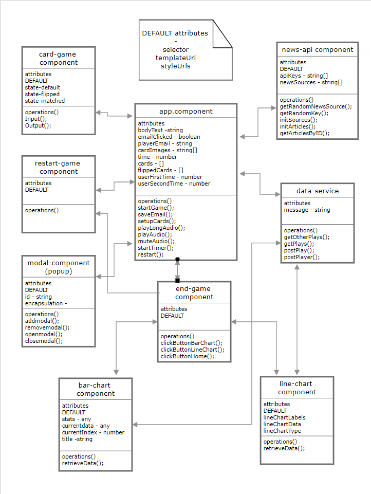
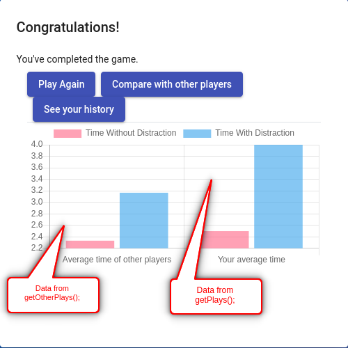
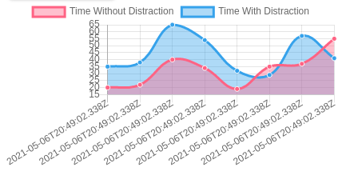
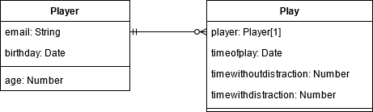
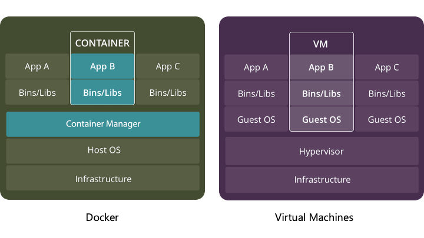

[&#8592; Back to Report Landing Page](../README.md)

## Table of Contents
1. [System Design Overview](#system-design-overview)  
2. [Frontend](#front-end-angular)   
   a. [Implementation](#implementation)  
   b. [Routing](#routing)  
   c. [Issues and Functionality of the Components](#issues-and-functionality-of-the-components)  
3. [Middle Tier](#middle-tier-express-node-restful-api)  
   a. [Choice of Software](#choice-of-software)  
   b. [Building the API routes](#building-the-api-routes)  
   c. [Using our API](#using-our-api)  
4. [Backend (MongoDB)](#back-end-mongodb)  
5. [Continuous Deployment using Docker](#continuous-deployment-using-docker)  
   a. [Primer](#primer)  
   b. [Deployment](#deployment)  
6. [Bibliography](#bibliography)  

# System Implementation
## System Design Overview
We chose to implement our SPA using the MEAN stack, a collection of software well suited to building dynamic web sites or applications. The driving force behind our choice was it's popularity. With so many resources available relating to use of the MEAN stack, it made drawing inspiration for our implementation and fixing the (inevitable) bugs far easier. The MEAN stack is as follows:

<ul>
<li> MongoDB - A NoSQL document-oriented database program </li>
<li> Express.js - Backend web application framework</li>
<li> Angular - Frontend web application framework</li>
<li> Node.js - Backend JavaScript runtime environment</li>
</ul>

Another thing to note is that all members of the stack are coded in JavaScript or TypeScript (a language <em>very</em> similar). This makes it easy for a team to work on since everyone can understand what each block of code is doing.

To best explain how we used this software to create our webpage, we use a helpful sequence diagram which encompasses most of our products functionality.

#### Sequence Diagram

<p align="center">
  
</p>
<p align="center">
  <em>Figure 1: Sequence Diagram showing how our website flows.</em>
  <br/><br/>
</p>

To aid comprehension of the diagram, when a User accesses the website, the Angular app.component.ts presents them with the welcome page HTML view. From this point, the user has some options. They can either look at the dev info, which prompts a pop-up component to display information. Alternatively, they may enter their email and begin the game. Upon doing so, depending on which point in the game they are at, various components are called (game-card, News-Api etc.). Functions within these components are then carried out and alter what the user sees on screen. It should be noted, some of these functions are those of the DataService, which, when called, send a request through Node and Express to our Database. Upon receiving this Http request, MongoDB sends back the required information in a JSON payload (Or, in the case of a POST request, a fulfilled promise).

#### Class diagram

To further clarify just how our frontend components interact and how that translates to the user experience, please find below a class diagram, listing the attributes, functions and links between our components. While we didn't include everything here since space was limited, this should give you an overview of how our SPA fits together.

<p align="center">
  
</p>
<p align="center">
  <em>Figure 2: Class Diagram showcasing the relationship between components.</em>
  <br/><br/>
</p>


## Front End (Angular)

### Implementation
#### Memory Card Game
The frontend was implemented by adapting a card game which can be found at https://zoaibkhan.com/blog/how-to-create-a-card-memory-game-in-angular/. The game was adapted so that the users could play two rounds, along with having their scores recorded, as discussed below.

#### Measuring the Users Score

As we planned to have two rounds, one with and one without distractions we needed a way to quantitatively differentiate between rounds. For this, we decided to use time to completion as a metric of user score. To implement this a function called `startTimer()`, which can be seen below, was created, which used JavaScripts built in `setInterval()` to calculate the time in seconds and the users first and second round score was placed into seperate variables to be picked up by the backend.

```js
startTimer(): void {
    console.log('Timer started');
    if (this.timerStart === false) {
      this.interval = setInterval(() => {
        if (this.time === 0) {
          this.time++;
        } else {
          this.time++;
        }
        this.display = this.transform( this.time);
      }, 1000);
    }
  }
  transform(value: number): string {
    const minutes: number = Math.floor(value / 60);
    return minutes + ':' + (value - minutes * 60);
  }
 ```
This was implemented within the main app.component.ts file, which contains most of the game logic. The memory card game implementation can be seen within the GameCardComponent and uses JavaScripts 'states' to animate the card.

#### Distractions
For the distraction elements of the game we decided to go with both visual and auditory distractions following feedback from the user survey. Having more than one distraction also aligns with the literature review, in that attention is a finite resource and the brain can only devote attention to a limited number of stimuli.

##### Visual Distractions
For the visual distractions, we decided to go with current news to align with what people might encounter during lockdown. To implement this, a new component 'news-api' was created which used News API [News API, 2021] to pull contempory articles. The card pulls an image, title and description which is placed inside of an angular card. For the articles, we randomly chose from the 3 most recent sources using the function getRandomNumber()
```js
getRandomNumber(min, max): number {
   return Math.random() * (max - min) + min;
 }
 ```
 to add some randomness between users and picked what we deemed the most contentious or attention grabbing news sources. An example of the news card can be seen below.


<p align="center">
  
</p>
<p align="center">
  <em>Figure 3: News card created using News API.</em>
  <br/><br/>
</p>

During the game, the news cards move across the screen in a seemingly random way, to further distract the user. To implement this, we first created an svg path with sudo random movements, before converting the path to coordinates. This then allowed us to make use of motion path within css to animate the div within its parent element. Although it would have been preferable to inject some randomness into the movement, for the task we deemed this suitable, along with it allowing us to easily adapt the code for future versions. The animated card can be seen below.

<p align="center">
  
</p>
<p align="center">
  <em>Figure 4: Animated Angular Card Displaying News</em>
  <br/><br/>
</p>

##### Auditory Distractions
For the auditory distractions we decided to gather several sounds we found distracting. These were further broken down into; ‘long’ sounds, for example children playing or a busy street; and ‘short’ sounds, such as a WhatsApp or Facebook notification. In this way a ‘long’ sound can be played at the beginning and throughout the game period along with several randomly selected ‘short’ sounds that are played at around 15 second intervals. To further improve the user experience, compression, reverb and gain reduction were applied using to the long sounds to give an element of background noise and panning was applied to the short sounds to give the appearance of location.

<p align="center">
  
</p>
<p align="center">
  <em>Figure 5: Adding reverb to 'construction.wav' in Audacity</em>
  <br/><br/>
</p>

### Routing
For the routing of our application we linked the two charts, BarChartComponent and LineChartComponent so that they can be displayed to the user after the game. This can be seen below.
```js
const routes: Routes = [
  {path: 'bar-chart', component: BarChartComponent},
  {path: 'line-chart', component: LineChartComponent}
];
```
As our game centered around the card game, there was not a need for much routing and we instead used Angular dialogs to mediate the rounds. For example, in app.component.ts, the EndGameComponent and RestartGameComponent are linked through dialogs as can be seen below.
```js
if (this.userSecondGame === true) {
  dialogRef = this.dialog.open(EndGameComponent, { height: '500px', width: '500px'
  });
} else {
  dialogRef = this.dialog.open(RestartGameComponent, {
    disableClose: true
  });
}
 ```

### Issues and Functionality of the Components
<table>
<tr>
  <th>Component</th>
  <th>Functionality</th>
  <th>Issues Encountered</th>
  <th>Resolution</th>
</tr>
<tr>
  <td>GameCardComponent</td>
  <td>A card game using angulars built in animations and mat-card. </td>
  <td>An issue that we encountered was that the game could be completed too quickly and therefore did not give enough time for the user to become distracted.</td>
  <td>To solve this, we edited the css and images to be of a smaller size and to still fit within the users sceen.</td>
</tr>
<tr>
  <td>NewsApiComponent</td>
  <td>An angular card using [News API](https://news-api.org) to pull contemporary news articles </td>
  <td>
  The site would sporadically stop displaying the cards.
  <br></br>
  The component always displayed the same news source.
  <br></br>
  The news card moved out of of the window and caused the window to expand unnecessarily along with the animation looking dull and unnatural.
  </td>
  <td>
  After some time, we realised that the loss of functionality was due to exceeding our API limit of 1000 requests per day, therefore we created a new account so that we could swap out the key when our limit was reached.
  <br></br>
  To allow for a random news source to be chosen each time, we decided on which sources would be the most distracting and then created an array of these for which one was randomly chosen on intialisation of the component.
  <br></br>
  Initially, to animate the cards we used translate to place the div in a random position on the screen and animate to a new, randomly created position. Although giving an element of randomness, due to the movements being stiffed it made the animations look rigid and dull. To correct this, we instead created an svg path and used motion and offset paths to animate, giving a more natural and smooth effect to the animation and also set the css for the parent div to `position: fixed;`to stop the animations extending the screen.
  </td>
</tr>
<tr>
  <td>EndGameComponent</td>
  <td>A component used to link to the users final scores and allow them to play again</td>
  <td>The dialog would not dissapear and allow the user to see their scores</td>
  <td>This was a relatively simple fix and involved allowing the dialog to be closed by using `[mat-dialog-close]="true"`</td>
</tr>
<tr>
  <td>RestartGameComponent</td>
  <td>A component that creates a dialog between rounds</td>
  <td>The implementation of this was relatively straightforward and therefore we did not run into any issues. </td>
  <td>N/A</td>
</tr>
</td>
</tr>
</table>

<p align="center">
  <em>Table 1: Issues and Functionality of the Components</em>
  <br/><br/>
</p>

## Middle Tier (Express, Node, RESTful API)

### Choice of software
<p> As seen when exploring our stack architecture, we chose to use Node and Express.js to implement our RESTful API. Aside from the general advantages of MEAN discussed above, there are several technical benefits to this software choice. </p>

 First and foremost, Node.js is quick. In the right scenario, it's non-blocking I/O combined with asynchronous request handling yield brilliant results. This is due to, despite being single-threaded in terms of executing JS code, it can delegate things like handling files, or network calls to different threads, which when optimized massively reduce execution time, shown well in this <a href="https://medium.com/paypal-tech/node-js-at-paypal-4e2d1d08ce4f" title="https://medium.com/paypal-tech/node-js-at-paypal-4e2d1d08ce4f">report</a>.

On the other end of the spectrum we have Express, which has a shallow learning curve and is a very intuitive way to create your own API, ideal for a simple SPA.

### API Goals
The goal of this project's API is to seamlessly and efficiently transfer data between the client and server, i.e our front and back end, based on the users game inputs. While simple, for it to qualify as a RESTful API, it must satisfy several constraints, which in the scope of our webpage are:
<ul>
<li>Client-server architecture</li>
<li>Statelessness</li>
<li>Cacheability</li>
<li>Uniform interface</li>
</ul>

For more information please see <a href ="https://restfulapi.net/" title="https://restfulapi.net/">here</a>.

### Building the API routes
 To begin, we adapt the boilerplate code shown below that sets up a basic API route using Node and Express (without these, it becomes a much more painstaking process).


Firstly, we add two new routes to our API which clearly separates what kind of data any function we write will handle, increasing the readability of the code.

```js
const express = require('express');
const router = express.Router();
const Player = require('../../models/player');
const playercommands = require('./player');
const playcommands = require('./play');

router.use('/player', playercommands);
router.use('/play', playcommands);

module.exports = router;
```
Now for the fun stuff;
#### Player Handling
```js
router.post('/', async (req, res) => {
  const player = new Player({
    email: req.body.email,
    birthday: req.body.birthday
    });
  try{
    const savedPlayer = await player.save()
    res.json(savedPlayer);
  } catch (err) {
    res.json({ message: err });
  }
});
```
#### Play Handling
```js
router.post('/', async (req, res) => {
  const player = await Player.find({email: req.body.email})
  const play = new Play({
    player: player[0]._id,
    timewithoutdistraction: req.body.time1,
    timewithdistraction: req.body.time2
    });
  try{
    const savedPlay = await play.save()
    res.json(savedPlay);
  } catch (err) {
    res.json({ message: err });
  }
});

router.get('/:playerEmail', async (req, res) => {
  try {
    const player = await Player.find({email: req.params.playerEmail})
    const playerId = player[0]._id;
    const plays = await Play.find({player: playerId})
    res.json(plays);
  } catch (err) {
    res.json({message : err});
  }
});

router.get('/other/:playerEmail', async (req, res) => {
  try {
    const player = await Player.find({email: { $ne: req.params.playerEmail}})
    let playerId = player[0]._id;
    let plays = [];
    for (let i = 0; i < player.length; i++) {
       playerId = player[i]._id;
       let playstemp = await Play.find({player: playerId})
       if (playstemp.length != 0) {
       plays.push(playstemp);
       }
    }
    res.json(plays);
  } catch (err) {
    res.json({message : err});
  }
});
```
These 4 functions completely encapsulate any interaction between the front and back end, by this I mean, only 4 requests can possibly be made to our game. Clearly, this fulfils the criterion of Client-server architecture and statelessness (the latter by inspection). As an aside, you may notice the use of several async/await blocks, which synergise well with the non-blocking I/O nature of node, as while the request is loading, the process is free to go back and take care of any other tasks the application may need.

For reference, these functions (in order):
<ol>
<li>Add a new "player" to the database</li>
<li>Add a new "play" to the database (with an associated player, per the schema)</li>
<li>Get the logged in players score history</li>
<li>Get the score history of all other players</li>
</ol>

### Using our API
With the API routes created, the next challenge was to integrate these requests into the frontend of our application. Since we want complete separation of the front and back end, it would be unwise to make http requests directly from our components. This could be due to readability concerns, but more importantly scalability. It is far easier to abstract out this process, so when changes are made it is done more efficiently and easily.

To do this, we made use of another mean stack component, Angular. Angular has inbuilt skeletons for "data services" which, in layman's terms, give common functions to all areas of the application, whether they make requests or simply share data. Please find ours below.
```js
export class DataService {

  private REST_API_SERVER = "http://localhost:3000/api";
  message:string

  constructor(private httpClient: HttpClient) { }

  setMessage(data){
    this.message=data;
  }

  public getOtherPlays(){
    return this.httpClient.get(`${this.REST_API_SERVER}/play/other/${this.message}`)
  }

  public getPlays(){
    return this.httpClient.get(`${this.REST_API_SERVER}/play/${this.message}`)
  }

  public postPlay(payload){
    let httpHeaders = new HttpHeaders({​​​​​'Content-Type' : 'application/json'}​​​​​);
    return this.httpClient.post(`${this.REST_API_SERVER}/play`, payload, {​​​​​headers: httpHeaders, observe: 'response'}​​​​​)
  }

  public postPlayer(payload){
    let httpHeaders = new HttpHeaders({​​​​​'Content-Type' : 'application/json'}​​​​​);
    return this.httpClient.post(`${this.REST_API_SERVER}/player`, payload, {​​​​​headers: httpHeaders, observe: 'response'}​​​​​)
  }
}
```
With this, we can make streamlined requests at any place in the frontend! (an obvious example being adding a player to the database once they've registered). This is very powerful, and makes calling the API as simple as copying in a line of code.

A good example of how we used the API in our SPA is in the bar and line charts. The data which the charts display is pulled from the API functions into the component, where it is manipulated and then finally shown to the user.

<p align="center">
  
</p>
<p align="center">
  <em>Figure 6 - Bar chart comparing users times.</em>
  <br/><br/>
</p>

<p align="center">
  
</p>
<p align="center">
  <em>Figure 7 - Line chart showing user history.</em>
  <br/><br/>
</p>

</p>

## Back End (MongoDB)
We chose MongoDB as our database. MongoDB is a NoSQL database which means it's flexible and easy to use. We prefer a NoSQL database to a SQL database because our application doesn't have huge amount of data to store and retrieve. Also with the popularity of the MEAN stack, it would be easier for us to find resources and solutions to potential problems online if we choose MongoDB.

Below is the entity relationship diagram of our data model. Player is in a separate table rather than in the Play table so that the whole data model conforms to normal forms although this is not required by MongoDB as a NoSQL database. The player field in Play table is a foreign key that refers to Player table. The timewithoutdistraction and timewithdistraction record the time in seconds a player spends finishing the game in without distraction round and with distraction round respectively. In the Player table, we use email to identify players. The email field is required and unique. We also added a birthday field and an age virtual property in the Player table, but they are not used in our current minimal viable product. For clarity, one schema per file was made in the ./models/ directory.

<br/><br/>

<p align="center">
  
</p>
<p align="center">
  <em>Figure 8: Our data model</em>
  <br/><br/>
</p>

## Continuous Deployment using Docker
### Primer
Docker is used for running applications in containers making them contain everything needed for running the application: runtimes, system tools, libraries, OS and everything you would otherwise need to install yourself to run the application. It ensures that the runtime environment of your application is constant – a massive advantage that development teams need not worry about setting up work environments and managing dependencies on the client side.

This contrasts more traditional forms of deployment including virtual machines (VMs), which can be infrastructurally expensive, because each VM requires its own underlying OS and a virtual copy of the hardware that the OS needs to run. This quickly adds up to a lot of RAM and CPU cycles.

<p align="center">
  
</p>
<div align="center">
  <em>Figure 9: Docker vs traditional full virtualization for deployment.</em>
  <br/><br/>
</div>

### Deployment
The main idea behind our Docker deployment strategy was to use a docker compose script to spin up two containers that would talk to each other while the application was being served. The following containers were deployed:
1. NodeJS container containing the Angular frontend and ExpressJS server
2. MongoDB container to persist the data in our application

#### Container 1: NodeJS Container
The following [`Dockerfile`](../site/../../site/Dockerfile) was used to create an image containing our Angular front end and server using Alpine linux as a parent image that is pulled directly from DockerHub.
The dependences are installed from the [`packages.json`](../../site/package.json) and port 3000 can then be accessed on the host machine to use the application.

#### Container 2: MongoDB Container
There was no need to build a custom image for the MongoDB container. We directly used the the official [`mongo:4.1.8-xenial`](https://hub.docker.com/_/mongo) image from DockerHub.

#### Container Orchestration
The [`docker-compose.yml`](../../site/docker-compose.yml) script was then used to orchestrate container creation and deployment.

Every container that is spun up can be thought of as a service. Services can talk to one another over a network based on the ports that have been exposed on each of the containers. The docker daemon creates this network internally and allows communication between containers.

Let us break the process down.

First, the NodeJS container is built from the same [`Dockerfile`](#container-1-nodejs-container) mentioned above, and is defined as a `nodejs` service.

```yaml
nodejs:
  build:
    context: .
    dockerfile: Dockerfile
  image: nodejs
  container_name: nodejs
```

Environment variables for this container are stored in the .env file and contain the credentials to login to our `db` service. We ensured that this file was added to our [`.gitignore`](../../site/.gitignore) file since it contained sensitive information of our users' login credentials.

```yaml
env_file: .env
environment:
  - MONGO_USERNAME=$MONGO_USERNAME
  - MONGO_PASSWORD=$MONGO_PASSWORD
  - MONGO_HOSTNAME=db
  - MONGO_PORT=$MONGO_PORT
  - MONGO_DB=$MONGO_DB
```

The second container that is spun up is the `db` service, which uses port `27018` internally in the container, and exposes port `27017` on the host machine.

```yaml
  db:
    image: mongo:4.1.8-xenial
    container_name: db
    restart: unless-stopped
    env_file: .env
    environment:
      - MONGO_INITDB_ROOT_USERNAME=$MONGO_USERNAME
      - MONGO_INITDB_ROOT_PASSWORD=$MONGO_PASSWORD
    ports:
      - "27018:27017"
```

The data in our `db` service is persisted as we define a volume called `dbdata` which is shared with the `/data/db` folder in the container.
```yaml
volumes:
  - dbdata:/data/db
```

There was an issue where the `nodejs` service kept restarting when spinning up the containers. This was resolved using the [`wait-for.sh`](../site/../../site/wait-for.sh) script and including the following line in the docker compose script.
```yaml
command: ./wait-for.sh db:27017 -- /home/node/app/node_modules/.bin/nodemon server.js
```

___

## Bibliography:

News API (n.d.) News API – Search News and Blog Articles on the Web [Online]. Available at https://newsapi.org [Accessed 27 April 2021].

Node.js at Paypal - [Online]. Available at https://medium.com/paypal-tech/node-js-at-paypal-4e2d1d08ce4f [Accessed 04 May 2021].

What is REST - [Online]. Available at https://restfulapi.net/ [Accessed 04 May 2021].

___

<p align="center">
  <b>Navigation:</b><br>
  <a href="../01-Background/README.md">&#8592; Previous Section: Background and Motivation</a> |
  <a href="#system-implementation">&#8593; Back to the top</a> |
  <a href="../03-UX-Design/README.md">&#8594; Next Section: UX Design</a>
</p>
