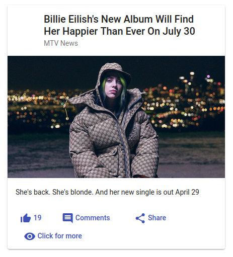
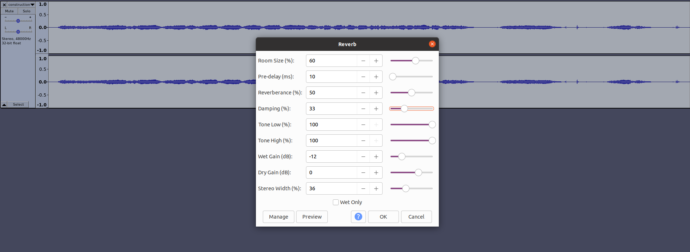

[&#8592; Back to Report Landing Page](../README.md)
# System Implementation
## System Design Overview
### Back End (MongoDB)
### Middle Tier (Express, Node, RESTful API)
### Front End (Angular)

#### Implementation
##### Memory Card Game
The frontend was implemented by adapting a card game which can be found at https://zoaibkhan.com/blog/how-to-create-a-card-memory-game-in-angular/. The game was adapted so that the users could play two rounds, along with having their scores recorded, as discussed below.

##### Measuring the Users Score

As we planned to have two rounds, one with and one without distractions we needed a way to quantitatively differentiate between rounds. For this, we decided to use time to completion as a metric of user score. To implement this a function called startTimer() was created, which used JavaScripts built in setInterval() to calculate the time in seconds and the users first and second round score was placed into seperate variables to be picked up by the backend.

##### Distractions
For the distraction elements of the game we decided to go with both visual and auditory distractions following feedback from the user survey. Having more than one distraction also aligns with the literature review, in that attention is a finite resource and the brain can only devote attention to a limited number of stimuli.

###### Visual Distractions
For the visual distractions, we decided to go with current news to align with what people might encounter during lockdown. To implement this, a new component 'news-api' was created an angular card was created using News API [News API, 2021] to pull contempory articles. The card pulls an image, title and description which is placed inside of an angular card. For the articles, we randomly chose from the 3 most recent sources to add some randomness between users and picked what we deemed the most contentious or attention grabbing news sources. An example of the news card can be seen below.

  

  <em>News card created using News API.</em>

###### Auditory Distractions
For the auditory distractions we decided to gather several sounds we found distracting. These were further broken down into; ‘long’ sounds, for example children playing and a busy street; and ‘short’ sounds, such as a WhatsApp or Facebook notification. In this way a ‘long’ sound can be played at the beginning and throughout the game period along with several randomly selected ‘short’ sounds that are played at around 15 second intervals. To further improve the user experience, compression, reverb and gain reduction were applied using to the long sounds to give an element of background noise and panning was applied to the short sounds to give the appearance of location.

  

  <em>Adding reverb to 'construction.wav' in Audacity</em>

#### Functionality and Issues of the Components
<table>
<tr>
  <th>Component</th>
  <th>Functionality</th>
  <th>Issues Encountered</th>
  <th>Resolution</th>
</tr>
<tr>
  <td>GameCardComponent</td>
  <td>A card game using angulars built in animations and mat-card. </td>
  <td>1. The game did not display enough cards</td>
  <td>1. Edited the css and images to be of a smaller size</td>
</tr>
<tr>
  <td>NewsApiComponent</td>
  <td>An angular card using [News API](https://news-api.org) to pull contemporary news articles </td>
  <td>The site would sporadically stop displaying the cards</td>
  <td>After some time, we realised that the loss of Functionality was due to exceeding our API limit, therefore we created a new account so that we could swap out the key when our limit was reached.</td>
</tr>
<tr>
  <td>EndGameComponent</td>
  <td>Issue 3</td>
  <td>Issue 2</td>
  <td>Solution 3</td>
</tr>
<tr>
  <td>RestartGameComponent</td>
  <td>Issue 3</td>
  <td>Issue 2</td>
  <td>Solution 3</td>
</tr>
</table>

### Continuous Deployment (Docker)
### Additional Components (think User Authentication)

### Bibliography:

News API (n.d.) News API – Search News and Blog Articles on the Web [Online]. Available at https://newsapi.org [Accessed 27 April 2021].

  <b>Navigation:</b> 
  <a href="../01-Background/README.md">&#8592; Previous Section: Background and Motivation</a> |
  <a href="#system-implementation">&#8593; Back to the top</a> |
  <a href="../03-UX-Design/README.md">&#8594; Next Section: UX Design</a>

