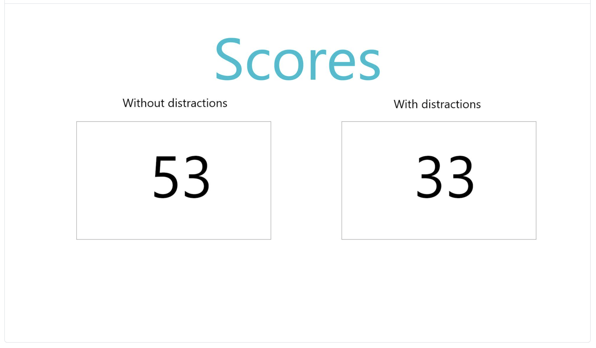
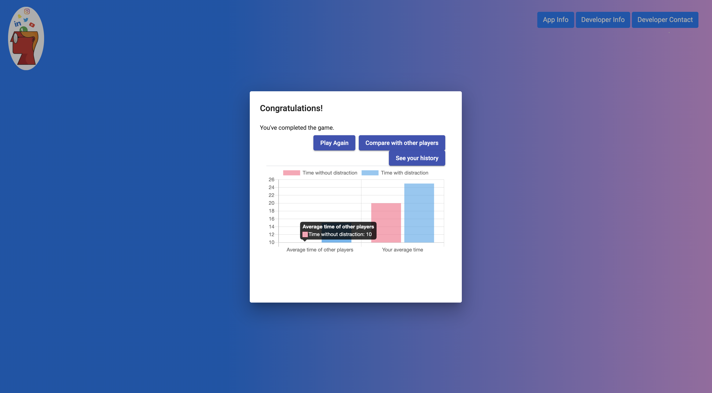

[&#8592; Back to Report Landing Page](../README.md)
# UX Design
## Prototyping
## Users and Stakeholders

  

  <em>Figure XX: A student persona.</em>

  

  <em>Figure XX: A teacher persona.</em>

## UX Approach (Heuristics & Design Methods)
The way we approached our user experience was by following Nielsen’s ten general principles during the design phase of our project.

  

  <em>Figure XX: Jakob Nielsen's ten general principles for interaction Design.</em>

[Refer to components in our application that show some of these principles have been taken into consideration?]

## User Group Definition

## End User Testing *DistractAbility* ##

### Research Objectives ###

During the initial prototyping stages our research objectives were as follows:

*    What sorts of distractions will best exemplify the difficulties of focusing on work during lockdown?
*    What sorts of mind-games will people find engaging?
*    Evaluate proposed user experience (flow and UI design).

Towards the end of the development phase our research objectives were as follows:

*    Test our hypothesis that the presence of distractions negatively impacts performance.
*    Test our hypothesis that DistractAbility does effectively highlight the serious problem.
*    Evaluate distractions used in the second round.
*    Evaluate user experience.
*    Feedback on potential future improvements.

### Methodology ###

*    Two rounds of survey testing
*    One round of moderated user testing

### Ethnography: Survey 1 ###

Age  |  Gender | Background (technical/non-technical)
:-------------------------:|:-------------------------:|:-------------------------:
  |   |  

### Ethnography: Survey 2 ###

Age  |  Gender | Background (technical/non-technical)
:-------------------------:|:-------------------------:|:-------------------------:
  |   |  

### Survey 1: Testing the initial prototype ###

View the initial prototype [here](../../Source/01-Paper-prototype/paper-prototype.pdf). View the survey questions [here](FirstSurvey/SurveyRound1_Questions.pdf).

**Timeline**
*    Participants were sent the prototype and a summary of our project brief and asked to go over both before the group zoom call. 
*   24 hours after being sent the prototype, the researcher held a group zoom call with subsets of study participants - not all participants attended the same zoom. 
* During the zoom call, the researcher walked everyone through the prototype, answering questions as they came up.
*    Immediately after the zoom call, participants were sent the questionnaire and asked to respond without consulting other participants in the group.
* We received fourteen [responses](FirstSurvey/Survey1_Responses.xlsx). See a more visual representation [here](FirstSurvey/SurveyRound1_Answers.pdf).

  

  <em>Example zoom walk through held with participants.</em>

**Research Question**:  What sorts of distractions will best exemplify the difficulties of focusing on work during lockdown? *Covered by survey questions 3-5*.

**Findings**
*    Respondents would most like to see ‘Advanced Sound’ (92.9%) closely followed by ‘Advanced Animation’ (78.6%). The least popular option was ‘Player Specific Demands’ (7.1%).
*    Respondents want distractions that relate to the typical lockdown experience – suggestions included P.E. with Joe Wicks and construction sounds (one respondent reported "a lot of DIY in lockdown and it was very annoying").  
*   Most respondents would prioritise mobile phone and social media notification sounds. 

**Impact**
*    We play a variety of what we consider ‘advanced sounds’, including ten different mobile phone and social media sound effects – more than any other type of distraction. Examples include an incoming [Microsoft Teams call](sounds/teamsCall.mp3), a [WhatsApp message](sounds/whatsappIncoming.mp3) and a [Facebook message](sounds/facebookCall.mp3). When related to the theoretical background discussed in the literature review, these sounds reflect the kinds of distractions that would fall in the ‘continuity’ camp.
*    The news articles pulled in through the API are animated such that they move across the screen and change size.
*    In order to tie the distracting sounds to the typical lockdown experience we included [construction sounds](sounds/construction.wav), the [BBC theme song](sounds/BBC.mp3), and soundbites from Netflix’s [*Tiger King*](sounds/joeExotic2.mp3) - the second most watched TV series globally in 2020. 
*    We omitted player specific demands. 

**Evaluation:** The options presented in *Question 3* included examples of what we envisaged for each type of distraction. For instance, one option was ‘Advanced Sound (e.g. notification bells, incoming WhatsApp sound, BBC theme song)’. Providing these specific examples in a tick-box question does not provide much scope for participants to express a different view of what they consider an ‘Advanced Sound’ and the like. However, we believe we corrected this limitation with the following question, which gave respondents an open text box in which to make any additional suggestions as to what kind of distractions they would like to see. 

  

  <em>Responses to Question 3.</em>

**Research Question**: What sorts of mind-games will people find engaging?

**Findings**
*   People would most like to play Logic Games, followed by Maths Games then General Knowledge.
*   Some concern that general knowledge type games may not be a fair assessment, as what is general knowledge to one person is not common knowledge to the next.  

**Impact**
*    We took into consideration the preference for logic and mathematical games. But given the limitation in the way we asked this question (discussed below), we did not consider this preference more important than our primary objective of using a game that relies on working memory, given the link between working memory and concentration. 
*    We saw that a general knowledge-based game might reduce the broadness of appeal of our application. We, the developers, are all similar in age and other demographic categories and so what is general knowledge to us is less likely to be general knowledge for as many people in other age ranges and demographics.

**Evaluation:** In hindsight *Question 7* was poorly designed, although we believe *Question 8* did somewhat atone for the limitations of 7. *Question 7* asked 'What kinds of mind games would you like to see?' and provided five options, with respondents able to select as many as they agreed with. For more analytic games we gave very broad categories (‘Maths Games’, ‘Logic Games’), whereas the options which might be preferred by less mathematically inclined individuals were incredibly specific (‘Play Music, guess the artist’, ‘sudoku’). This may have biased respondents in favour of Maths and Logic games even if they would have generally preferred less analytical games, but simply have a specific dislike of sudoku, for instance. In fact, the broader the definition the more popular the option – so perhaps the preference for maths and logic games is due to this flaw in our methodology, rather than a genuine preference for more analytical games. Indeed, *Question 8* gave respondent’s free reign to write their comments about what kinds of games they would like to see in the application, and qualitatively, the preference was less heavily in favour of explicitly analytic games.

  

  <em>Responses to Question 7.</em>

**Research Question**: Evaluate proposed user experience (flow and UI design).

**Findings**
* 64% of respondents agreed the application should have the given structure, i.e. two roudns the first without distraction and the second with.
* Respondents would like to see the effect of distraction on concentration *after* distractions have ceased. Some suggested a hybrid round that measures the effect of previous distraction on concentration. Others suggested an interlude between round one and two to allow the user to refresh.
* In terms of UI design, respondents were fairly evenly split between preferring a minimalist design to something bold and colourful. 

**Impact**
* In line with the majority view we retained the two-round structure.
* We will consider future improvements that include adding additional rounds in which the distractions are inconstant. 
* Due to the lack of consensus on UI design we chose a bold and colourful aesthetic, which we feel is more memorable.  

**Evaluation:** Our initial prototype was very basic and aesthetically really quite boring. Given that almost all of our respondents were from non-technical backgrounds, it was perhaps difficult for them to comment on the UI design without much inspiration in front of them. 

Prototype Results Page  |  Final Product Results Page
:-------------------------:|:-------------------------:
  |  

-----------------------

### Survey 2: Testing hypotheses and evaluating final product ###

View the survey questions [here](SecondSurvey/SurveyRound2_Questions.pdf).

**Timeline**

* Most participants in this group were sent the survey and then left alone in a room with *DistractAbility* open on the researcher's PC. They were asked to make their way through the application and then respond to the survey in one sitting.
* A small subset of participants did not have first hand experience of engaging with *DistractAbility*. Instead, they were asked to complete the survey to the best of their ability after watching our demo video.
* We received seventeen [responses](SecondSurvey/Survey2_Responses.xlsm). See a more visual representation [here](FirstSurvey/Survey2_Answers.pdf).

**Research Question**: Test our hypothesis that the presence of distractions negatively impacts performance.

**Findings**
* 76.5% of respondents found the card game harder to complete in the second round, in the presence of distractions, than in the first round.

**Impact**

  

  <em>Responses to Question 2.</em>

**Research Question**: Test our hypothesis that *DistractAbility* does effectively highlight the serious problem.

**Findings**
* 100% of respondents agreed that *DistractAbility* "does a good job of demonstrating the problem of heightened distractibility in the context of COVID-19".

**Impact**

  

  <em>Responses to Question 3.</em>

**Research Question**: Evaluate distractions used in the second round.

**Findings**

**Impact**

**Research Question**: Evaluate user experience.

**Findings**

**Impact**

**Research Question**: Feedback on potential future improvements.

**Findings**

**Impact**

**Evaluation of Survey 2**

### Summary ### 

## Wireframes/Interaction Flow Diagrams
For the project, our initial idea involved creating a single page web application centred around making sustainable fashion choices. For the paper prototype, we used collaborative image software to test the feasibility and look of our idea. Although ideally we would have liked to do this using a traditional pen and paper approach, due to covid restrictions this was not possible. The results of this can be seen below.

  
  

  <em>Paper Prototype Representing our Initial Idea.</em>

Further along on the project, we decided as a group that it would be better to implement our second idea, the distraction game. Therefore, we created another prototype using adobe XD. The software, along with allowing us to create a protype, also allowed us to implement interactions between the different elements. The wireframe created involved a login page, two rounds of the card game we were planning to implement and also two charts at the end to display the users score, along with that of all other users of the games score.
For the design, as a group we tried to focus on several key elements, namely:
- Creating a circular user experience, where they are able to replay the game
- Keeping the design 'barebones' in order to allow for greater feature implementation at a later date
- Making the purpose of the game clear

The creation of this wireframe also allowed us to gather some early feedback from users, which further aided us in implemting a user centric methodology. Some of the key feedback included:
- Use advanced sounds, such as WhatsApp and Facebook notifications for the auditory distraction element.
- Use adanced animations, such as a spinning news article for the visual distraction element.
- Use background sounds as well, for example construction or a baby crying to further engage the user.
- Use logic and maths based games
- Keep the games fairly simple to allow for a wider audience access.
- Explain the benefits of user distraction.

The wireframes can be found [here](https://github.com/keane-fernandes/Group1Project/tree/dev/Source/01-Paper-prototype "Paper Prototype Folder").

Alternatively, a gif of the paper prototype as seen in Adobe XD can be seen below.

  

  <em>Paper Prototype Representing our Final Idea.</em>

  <b>Navigation:</b> 
  <a href="../02-System-Implementation/README.md">&#8592; Previous Section: System Implementation</a> |
  <a href="#ux-design">&#8593; Back to the top</a> |
  <a href="../04-PM-Sprints/README.md">&#8594; Next Section: Sprints and Project Management</a>

