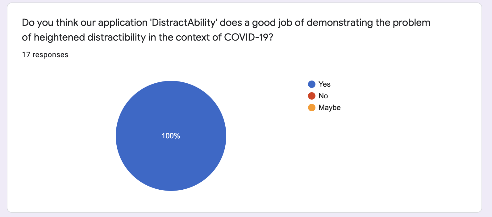

  [&#8592; Back to Report Landing Page](../README.md)
# UX Design
## Prototyping
## Users and Stakeholders

  

  <em>Figure XX: A student persona.</em>

  

  <em>Figure XX: A teacher persona.</em>

## UX Approach (Heuristics & Design Methods)
The way we approached our user experience was by following Nielsen’s ten general principles during the design phase of our project.

  

  <em>Figure XX: Jakob Nielsen's ten general principles for interaction Design.</em>

[Refer to components in our application that show some of these principles have been taken into consideration?]
Obviously, not all of these had equal influence. For example, the flexibility and efficiency of use generally refers to an experienced user being able to carry out more advanced tasks. Given the small size and precise goal of our application, advanced options would only serve to detract from it's purpose, or potentially discourage first-time users. Despite this, we were still considerate of those users who truly do want to know more about our project, and have provided means to contact us if they so wish.

As a team, we then decided on the most important of these principles, which we would strive to implement across our app. These were:
<ul>
<li>Match Between System & Real World </li>
<li>User Control and Freedom </li>
<li>Consistency And Standards </li>
<li>Aesthetic and Minimalist Design </li>
</ul>

#### Match Between System And The Real World

Clearly, when designing a web app with "Serious Play" in mind, it is essential that the user can almost immediately identify the issue being tackled. In addition to this, the User should relate in some way to the material presented, whether it be through choice of language, or that the webpage is natural to navigate off of instinct. Since the pandemic has had such a massive global impact, we had our work cut out for us in terms of users relating to the issue. However, it was vital that the distractions we chose to implement throughout our game matched those that the average user would experience. It would be of no use to anyone if the distractions were unrealistic or silly, which would take away hugely from the user experience.

We kept this in mind when designing our surveys for initial end user testing, with a question specifically relating to this issue. For a full breakdown, please see the relevant section below!

#### User Control And Freedom

#### Consistency And Standards

Given our application is contained within a single page, consistent formatting and presentation of the interface is paramount. Thus, during the building process it was decided that we'd stick to simple CSS templates. Once the website was functional, i.e users could log in and play the game, only then would we decide on any additional formatting changes as required. Otherwise, if different people designed different sections of the website we could end up with a confusing or contradictory interface, a simple example being the picture shown below.  

  

  <em>Figure XX: An example inconsistency in a website.</em>

#### Aesthetic and Minimalist Design

## User Group Definition

## End User Testing *DistractAbility* ##

### Research Objectives ###

During the initial prototyping stages our research objectives were as follows:

*    What sorts of distractions will best exemplify the difficulties of focusing on work during lockdown?
*    What sorts of mind-games will people find engaging?
*    Evaluate proposed user experience (flow and UI design).

Towards the end of the development phase our research objectives were as follows:

*    Test our hypothesis that the presence of distractions negatively impacts performance.
*    Test our hypothesis that DistractAbility does effectively highlight the serious problem.
*    Evaluate distractions used in the second round.
*    Evaluate user experience.
*    Feedback on potential future improvements.

### Methodology ###

*    Two rounds of survey testing
*    One round of moderated user testing

### Survey 1: Testing the initial prototype ###

View the initial prototype [here](https://github.com/keane-fernandes/Group1Project/tree/dev/Source/01-Paper-prototype/paper-prototype.pdf). View the survey questions [here](https://github.com/keane-fernandes/Group1Project/tree/dev/Report/03-UX-Design/FirstSurvey/SurveyRound1_Questions.pdf).

**Timeline**
*    Participants were sent the prototype and a summary of our project brief and asked to go over both before the group zoom call.
*   24 hours after being sent the prototype, the researcher held a group zoom call with a subset of study participants. During the zoom call, the researcher walked everyone through the prototype, answering questions as they came up.
*    Immediately after the zoom call, participants were sent the questionnaire and asked to respond without consulting other participants in the group.
* We received fourteen [responses](FirstSurvey/Survey1_Responses.xlsx). See a more visual representation [here](FirstSurvey/Survey1_Answers.pdf).

  

  <em>Example zoom walk through held with participants.</em>

**Research Question**:  What sorts of distractions will best exemplify the difficulties of focusing on work during lockdown? *Covered by survey questions 3-5*.

**Findings**:
*    Respondents would most like to see ‘Advanced Sound’ (92.9%) closely followed by ‘Advanced Animation’ (78.6%). The least popular option was ‘Player Specific Demands’ (7.1%).
*    Respondents want distractions that relate to the typical lockdown experience – suggestions included construction sounds and P.E. with Joe Wicks.
*   Most respondents would prioritise mobile phone and social media notification sounds.

**Impact**:
*    We omitted player specific demands.
*    We built a variety of what we consider ‘advanced sounds’. Importantly, our choice of sound effects is linked to the theoretical background discussed in the literature review. For instance, to reflect the kinds of distractions that would fall in the ‘continuity’ camp, we included notification sounds such as the that of an incoming Microsoft Teams call or a WhatsApp message.
*    The news articles pulled in through the API are animated such that they move across the screen and change size.
*    In order to tie the distracting sounds to the typical lockdown experience we included construction sounds, the BBC theme song, and soundbites from Netflix’s *Tiger King* - the second most watched TV series globally in 2020.
*    We have ten different mobile phone and social media sound effects – more than any other type of distraction.

Sample the kinds of sounds included in our application [here](sounds/teamsCall.mp3), [here](sounds/joeExotic2.mp3) and [here](sounds/BBC.mp3).

**Evaluation**: The options presented in *Question 3* included examples of what we envisaged for each type of distraction. For instance, once option was ‘Advanced Sound (e.g. notification bells, incoming WhatsApp sound, BBC theme song)’. Providing these specific examples in a tick-box question does not provide much scope for participants to express a different view of what they consider an ‘Advanced Sound’ and the like. However, we believe we corrected this limitation with the following question, which gave respondents an open text box in which to make any additional suggestions as to what kind of distractions they would like to see.

  

  <em>Responses to Question 3.</em>

**Research Question**: What sorts of mind-games will people find engaging?

**Findings**:
*   People would most like to play Logic Games, followed by Maths Games then General Knowledge.
*    General knowledge type games may not be a fair assessment as what is general knowledge to one person is not common knowledge to the next.

**Impact**:
*    We took into consideration the preference for logic and mathematical games, but noted the importance of a game that relies on working memory, given the link between working memory and concentration.
*    We saw that a general knowledge-based game might reduce the broadness of appeal of our application. We are all similar and age and other demographic categories and so what is general knowledge to us is less likely to be general knowledge for as many people in other age ranges and demographics.

**Evaluation**: The options provided for *Question 7* were unequally broad in their definition. For more analytic games we gave very broad categories (‘Maths Games’, ‘Logic Games’), whereas the options we gave which might be preferred by less mathematically inclined individuals were incredibly specific (‘Play Music, guess the artist’, ‘sudoku’). This may have biased respondents in favour of Maths and Logic games even if they would have generally preferred less analytical games, but simply have a specific dislike of sudoku, for instance. In fact, the broader the definition the more popular the option – so perhaps the preference for maths and logic games is due to this flaw in our methodology, rather than a genuine preference for more analytical games. Indeed, *Question 8* gave respondent’s free reign to write their comments about what kinds of games they would like to see in the application, and qualitatively, the preference was less heavily in favour of logical games.

  

  <em>Responses to Question 7.</em>

**Research Question**: Evaluate proposed user experience (flow and UI design).

**Findings**:
* 64% of respondents agreed the application should have the given structure, i.e. two roudns the first without distraction and the second with.
* Respondents would like to see the effect of distraction on concentration *after* distractions have ceased. Some suggested a hybrid round that measures the effect of previous distraction on concentration. Others suggested an interlude between round one and two to allow the user to refresh.
* In terms of UI design, respondents were fairly evenly split between preferring a minimalist design to something bold and colourful.

**Impact**:
* We retained the two-round structure, but will consider adding additional rounds in which the distractions are inconstant.
* Due to the lack of consensus on UI design we chose a bold and colourful aesthetic, which we feel is more memorable.

### Moderated User Testing ###

As part of our end user testing we carried out two moderated user tests, in which the participants each sat with one of the developers and were guided through playing the game, before an informal interview was carried out. Although the interview itself was unstructured, the responses of the participants will be evaluated against the five previously discussed research objectives.

The first participant was a 30 year old male who works as a mechanical engineer and frequently codes as part of his job, he took 45 seconds to complete the first round of the game and 1 minute 10 to complete the second.

The second participant was a 25 year old male student with a non-technical background, he took 43 seconds to complete the first round of the game and 55 seconds to complete the second.

#### Responses

##### Test our hypothesis that the presence of distractions negatively impacts performance.
###### User 1
The participant mentioned during the interview that he found that the presence of distractions greatly inhibited his ability to focus and therefore negatively affected his performance on the game. He discussed how he felt his short term memory was impeded by the distractions and that his attention felt diffuse throughout the second round. This was backed up qualitatively in that he scored a much worse time during the second round.

###### User 2
The participant discussed how although initially he found the distractions off-putting, he felt that after a short while he was able to block them out and focus his attention entirely on the game. Although the participant felt that his performance was not negatively affected by the distractions, his score does not reflect this and it took him much longer to complete the round.

##### Evaluate distractions used in the second round.
###### User 1
The first participant mentioned how he felt that the sounds used were a good feature and that they were highly relevant given the amount of people home working. He said that although he did find the news articles distracting, he felt that more should have been used. When asked if the participant would have added any more elements, he stated that he felt the two were enough and anymore could have had the opposite effect and allowed the user to drown out the sounds.

###### User 2
The second participant left similar comments to the first. He thought that the sounds chosen worked well and that although he thought the news articles were a good addition, adding more would have been beneficial. The user also commented on how he felt that video would have improved the distractibility of our news items.

##### Evaluate user experience.
###### User 1
The participant said that he enjoyed the overall user experience and felt that the game 'flowed well' and was 'enjoyable to play'
###### User 2
The participant left similar comments and mentioned that he enjoyed the game and felt it was intuitive and 'easy to use'.

##### Feedback on potential future improvements.
###### User 1
The user felt that he improved as he played the game and suggested that we randomise the order of the rounds, so that the distracting round may come first. He also added that it would be good for us to add further games and allow the user to choose between them.

###### User 2

The participant made several suggestions throughout the interview. Similar to the first user, he felt that the game would be improved with the addition of more games to chose from. The user also mentioned that he would have liked to be able to create and account and felt concerned around the security aspects of our site.

### Survey 2: Testing hypotheses and evaluating final product ###

View the survey questions [here](SecondSurvey/SurveyRound2_Questions.pdf).

**Timeline**

* Most participants in this group were sent the survey and then left alone in a room with *DistractAbility* open on the researcher's PC. They were asked to make their way through the application and then respond to the survey in one sitting.
* A small subset of participants did not have first hand experience of engaging with *DistractAbility*. Instead, they were asked to complete the survey to the best of their ability after watching our demo video.
* We received seventeen [responses](SecondSurvey/Survey2_Responses.xlsm). See a more visual representation [here](FirstSurvey/Survey2_Answers.pdf).

**Research Question**: Test our hypothesis that the presence of distractions negatively impacts performance.

**Findings**:
* 76.5% of respondents found the card game harder to complete in the second round, in the presence of distractions, than in the first round.

**Impact**:

  

  <em>Responses to Question 2.</em>

**Research Question**: Test our hypothesis that *DistractAbility* does effectively highlight the serious problem.

**Findings**:
* 100% of respondents agreed that *DistractAbility* "does a good job of demonstrating the problem of heightened distractibility in the context of COVID-19".

**Impact**:

  

  <em>Responses to Question 3.</em>

**Research Question**: Evaluate distractions used in the second round.

**Findings**:

**Impact**:

**Research Question**: Evaluate user experience.

**Findings**:

**Impact**:

**Research Question**: Feedback on potential future improvements.

**Findings**:

**Impact**:

**Evaluation of Survey 2**

### Summary ###

## Wireframes/Interaction Flow Diagrams
For the project, our initial idea involved creating a single page web application centred around making sustainable fashion choices. For the paper prototype, we used collaborative image software to test the feasibility and look of our idea. Although ideally we would have liked to do this using a traditional pen and paper approach, due to covid restrictions this was not possible. The results of this can be seen below.

  
  

  <em>Paper Prototype Representing our Initial Idea.</em>

Further along on the project, we decided as a group that it would be better to implement our second idea, the distraction game. Therefore, we created another prototype using adobe XD. The software, along with allowing us to create a protype, also allowed us to implement interactions between the different elements. The wireframe created involved a login page, two rounds of the card game we were planning to implement and also two charts at the end to display the users score, along with that of all other users of the games score.
For the design, as a group we tried to focus on several key elements, namely:
- Creating a circular user experience, where they are able to replay the game
- Keeping the design 'barebones' in order to allow for greater feature implementation at a later date
- Making the purpose of the game clear

The creation of this wireframe also allowed us to gather some early feedback from users, which further aided us in implemting a user centric methodology. Some of the key feedback included:
- Use advanced sounds, such as WhatsApp and Facebook notifications for the auditory distraction element.
- Use adanced animations, such as a spinning news article for the visual distraction element.
- Use background sounds as well, for example construction or a baby crying to further engage the user.
- Use logic and maths based games
- Keep the games fairly simple to allow for a wider audience access.
- Explain the benefits of user distraction.

The wireframes can be found [here](https://github.com/keane-fernandes/Group1Project/tree/dev/Source/01-Paper-prototype "Paper Prototype Folder").

Alternatively, a gif of the paper prototype as seen in Adobe XD can be seen below.

  

  <em>Paper Prototype Representing our Final Idea.</em>

  <b>Navigation:</b> 
  <a href="../02-System-Implementation/README.md">&#8592; Previous Section: System Implementation</a> |
  <a href="#ux-design">&#8593; Back to the top</a> |
  <a href="../04-PM-Sprints/README.md">&#8594; Next Section: Sprints and Project Management</a>

