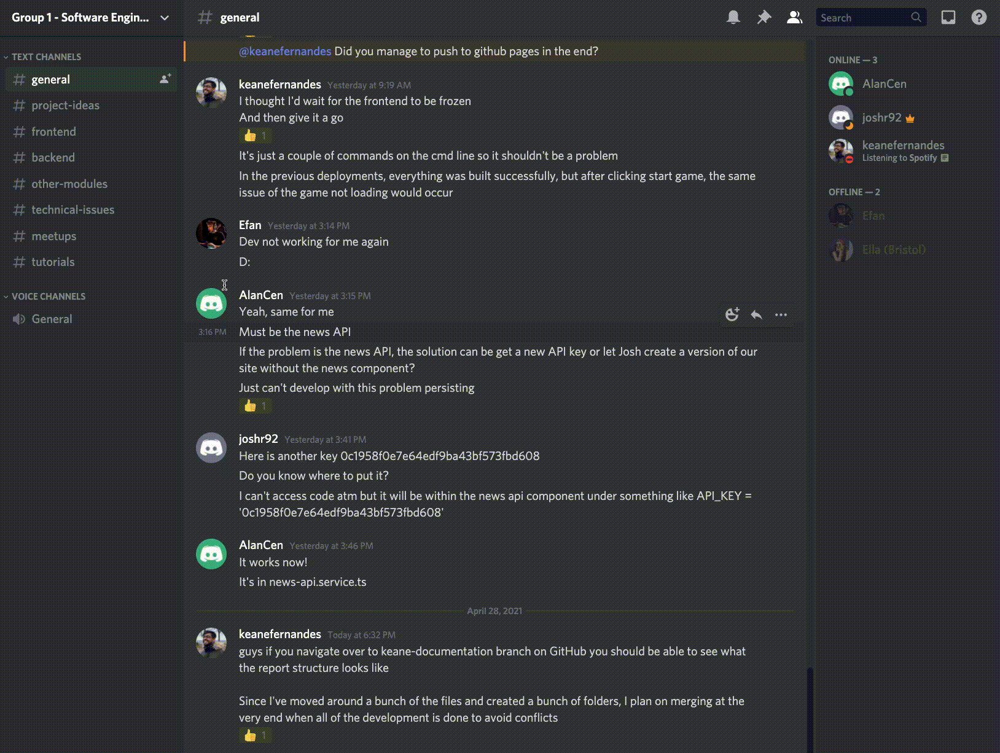

[&#8592; Back to Report Landing Page](../README.md)
# Sprints and Project Management
## Communication
Apart from Microsoft Teams, we used Discord for our general day to day communication. The Discord server was further split into channels to 
further streamline topics of discussion. The animation below provides a quick overview of our Discord server.

Weeks 1 to 5 were used to absorb the content delivered in the technical and design workshops. It gave the members the necessary information to decide on their roles in the project. 

## Agile Methodology
Our team decided to adopt the scrum approach of the agile working methodologies. The 
The nature of the project brief dictated a feature driven developement approach for our team. 
Our team decided to adopt scrum framework for our project. During the scoping of our project, we devised 6 main user stories that were essential to deliver our minumum viable product (MVP). 
These user stories were then further broken down into features t

Weeks 1 to 5 were used to absorb the content delivered in the technical and design workshops. It gave the members the necessary information to decide on their roles in the project.

From Week 6 onwards, we used Mondays, Wednesdays and Fridays at 10:00 AM to hold standups and discuss the current status of our project. In addition, we used the SEGP time slots on Mondays and Thursdays to discuss material relevant to the workshop and think about ways to integrate it into our project. 

This [log](../../Meetings/README.md) provides a top level summary of all of our standups.

## Sprints
Initially, we setup a Jira account account help document our sprints. However, the added overhead was turning out cumbersome and we decided to use GitHub projects to help document our sprints based on the suggestion of Marceli. This is the link to the [sprints](https://github.com/keane-fernandes/Group1Project/projects).

## User stories

| User Story                                                                                          | Sprint                                                                  |
| :-------------------------------------------------------------------------------------------------- | :---------------------------------------------------------------------- |
| As a user I want to click on new game to  be able to start and play a new game                      | [Sprint 1](https://github.com/keane-fernandes/Group1Project/projects/1) |
| As a user I want to click on information so that I can find out about the reasoning for the project | [Sprint 2](https://github.com/keane-fernandes/Group1Project/projects/3) |
| As a user I want to be able to see the landing page for the website                                 | [Sprint 3](https://github.com/keane-fernandes/Group1Project/projects/4) |
| As a user I want to be able to see the history of my recent games                                   | [Sprint 4](https://github.com/keane-fernandes/Group1Project/projects/5) |
| As a user I want to be able to compare my scores against past users of the game                     | [Sprint 5](https://github.com/keane-fernandes/Group1Project/projects/6) |

## CI/CD Pipeline

## Team Contributions

  <b>Navigation:</b> 
  <a href="../03-UX-Design/README.md">&#8592; Previous Section: UX Design</a> |
  <a href="#sprints-and-project-management">&#8593; Back to the top</a> |
  <a href="../05-Evaluation/README.md">&#8594; Next Section: Evaluation</a> 

---
# Mark Scheme
Group working methods used (for instance did your team choose a particular style of agile? what communication channels did you use?) 

Discussion of team roles (specialisation is ok!). A summary of individual contributions (note: this is for reference, your team will all receive the same grade!). 

Documentation of your sprints, including both high level overview, timeline, and selected highlights that were critical points in the project (remember to show the users stories implemented in each sprint). We expect a summary of meeting logs (including for instance apologies for absence etc) 

Team use of Git, how your team used continuous integration / continuous deployment. Streamlining of workflow throughout. 