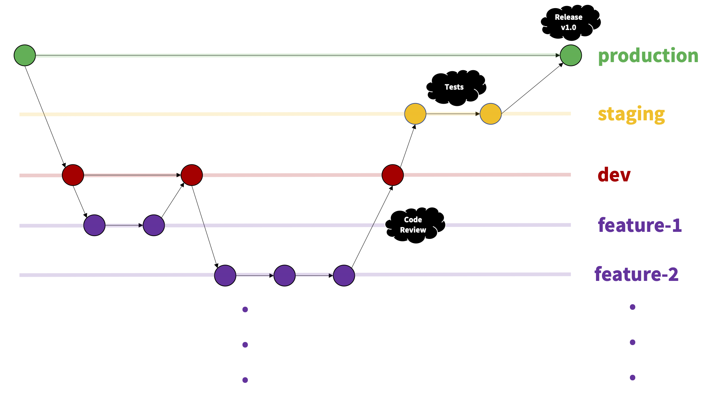

[&#8592; Back to Report Landing Page](../README.md)
# Sprints and Project Management
## Communication

### Communication Channels
Microsoft Teams was the primary tool for our daily standups and we used Discord for our general day to day communication. The Discord server was split into channels to further streamline topics of discussion. The graphic below provides a quick overview of our Discord server.

  
  <em>Figure XX : Team discord server.</em>

### Weeks 1 - 5
We used this time to absorb the content delivered in the technical and design workshops and implement the walkthroughs on our own machines. This gave the us the necessary information to decide on which roles we would undertake during our sprints. Therefore, our communication during these five weeks was just limited to the Tuesday and Thursday SEGP workshop timeslots. 

### Weeks 6 - 10
From Week 6 onwards, we held standups on Mondays, Wednesdays and Fridays at 10:00 AM. In addition, we used the design and technical workshops on Tuesdays and Thursdays to further discuss how we would go about integrating the week's material into our repository. 

The [meeting logs](../../Meetings/README.md) provide a top level summary of all of our standups.

## Agile Working
### Choice of Methodology
This was one of the 

Given the feature-centric, modular nature of the project brief, we decided to adopt the **scrum methodology** of the agile workflow for our project.

The three methodologies we considered for our project were:
1. Scrum (subset of agile)
2. Kanban (subset of agile)
3. Waterfall

We made our decision based on several factors that were critical to deliver this project in the leanest and most efficient manner given the tight time schedule. A summary of these factors are presented below:

|                                 | Waterfall                                                                                                                                                                         | Scrum                                                                                                                                                       | Kanban                                                                               |
| ------------------------------- | --------------------------------------------------------------------------------------------------------------------------------------------------------------------------------- | ----------------------------------------------------------------------------------------------------------------------------------------------------------- | ------------------------------------------------------------------------------------ |
| Workflow                        | Linear sequential model                                                                                                                                                           | Short, iterative sprints                                                                                                                                    | Continuous flow                                                                      |
| Software Developement Lifecycle | Divided into phases                                                                                                                                                               | Every sprint is essentially an SDLC, perfect for short, time critical projects                                                                              | Suits a ticket-based or inventory based project                                      |
| Planning                        | Rigid and extensive documentation required before the start of the project                                                                                                        | A backlog of tasks and user stories that can be implemented flexibly with sprints                                                                           | Task laid out in a backlog and are completed iteratively over time, similar to Scrum |
| Change Management               | Mostly tedious because of all of the preplanned schedules                                                                                                                         | Changes can be introduced flexibly even late in the cycle because of the short-lived nature of sprints                                                      | Similar to Scrum                                                                     |
| Stakeholder Collaboration       | After the requirements specification from the stakeholders and clients, there is no collaboration until delivery of the first prototype of the product                            | Maximum customer collaboration and intervention possible due to continous delivery at the end of each sprint                                                | More customer-driven as compared to Waterfall, but lesser compared to Scrum          |
| Issue Identification            | Due to the lack of iterative review, issues become apparent upon delivery to the client                                                                                           | Issues are identified during sprints and can be rectified immediately                                                                                       | Similar to Scrum                                                                     |
| Scheduling                      | Given that meticulous planning is mandatory at the start if the project, this is a massive disadvantage to inexperienced teams as they are unable to estimate the effort required | The short lived nature of sprints provide invaluable insight into the abilities of team members early in the project, making scheduling a lot more accurate | Irrelevant                                                                           |
| Team Size                       | Suitable for big teams                                                                                                                                                            | Teams between 3-10 members                                                                                                                                  | Inconsequential                                                                      |

  
<em> Table XX : Potential team workflows categorised by decision criteria.</em>

### Implementation of Scrum

#### Step 1: Project Vision and Scoping

Find the results of our scoping workshop and put it in here.

Enter a high level overview and timeline here. Highlight critical points in the project here.

#### Step 2: User Story Creation

A key step in the scrum workflow is the ideation of the user stories necessary to deliver a minimum viable product (MVP). We believe that the following user stories were essential to do so:

| User Story                                                                                                            | Sprints                                                                  |
| :-------------------------------------------------------------------------------------------------------------------- | :---------------------------------------------------------------------- |
| User Story 1: As a user, I want to click on new game to be able to start and play a new game.                         | [Sprint 1](https://github.com/keane-fernandes/Group1Project/projects/1) |
| User Story 2: As a user, I want to click on information so that I can find out about the reasoning behind the project | [Sprint 2](https://github.com/keane-fernandes/Group1Project/projects/3) |
| User Story 3: As a user, I want to be able to see the landing page for the website.                                   | [Sprint 3](https://github.com/keane-fernandes/Group1Project/projects/4) |
| User Story 4: As a user, I want to be able to see the history of my recent games.                                     | [Sprint 4](https://github.com/keane-fernandes/Group1Project/projects/5) |
| User Story 5: As a user, I want to be able to compare my scores against past users of the game.                       | [Sprint 5](https://github.com/keane-fernandes/Group1Project/projects/6) |

  
<em> Table XX : User stories essential for our minimum viable product.</em>

#### Step 3: Sprint Planning, Execution and Repeat
Initially, we setup a Jira account account to help document our sprints. However, the added overhead was turning out cumbersome and we decided to use [GitHub projects](https://github.com/keane-fernandes/Group1Project/projects) to document our sprints based on the suggestion of Marceli. 

Essentially, the way we approached our sprints were as follows:
1. At the start of the week, the team would pick a user story and break that down into smaller subtasks and categorise them into front end, back end or devops tasks.
2. Every member would assume repsonsibility of these subtasks based on their expertise and role in the team and branch off to work (no pun intended).
3. During the week, daily standups would happen on Teams and verbal communication pertaining to issues/solutions would occur on the Discord server.
4. At the end of the week, the team would reconvene for a review of how the week's work went.

## CI/CD Pipeline
### Continuous Integration with GitHub
Our team achieved continuous integration by adopting a fairly standard git worflow consisting of **production**, **staging**, **dev** and **feature** branches. 

The **dev** branch was essentially a working master branch where all of the team members would merge their feature branches. 

In the event of a new feature to be added, the relevant team member would perform the following standard workflow:
1. Branch off of the most recent commit on the **dev** branch into a new **feature-branch**. 
2. Perform the neccessary code commits and the tests needed to implement the feature. 
3. Conduct a review of this newly written code with the rest of the team at the next daily standup. 
4. Merge commit into the **dev** branch and repeat with the next feature.

At the end of each sprint, depending on if we collectively agreed that the current version of our product on the **dev** branch could be deployed as a fully functional product, we would then merge **dev** into **staging**.

The **staging** branch, as the name suggests, was used to stage potential releases of our web application. Our product would be manually tested here to ensure that it worked as expected after which it would be merged into **production** as a release. 

For the sake of completeness, it is important to mention that the **production** branch was reserved for fully tested and stable working releases of our web application. 

  
  
<em> Figure XX : Continuous integration using git</em>

### Continuous Deployment with Docker
####

Docker compose script was imperative for continuous deployment.

Talk about how both of these tools streamlined our workflow (maybe with the help of an image?)

## Team Contributions
Discussion of team roles.

Fill this in in a standup.

| Team Member          | Contribution |
| :------------------- | :----------- |
| Joshua Robertson     |              |
| Alan Cen             |              |
| Ella Gryf-Lowczowska |              |
| Efan Haynes          |              |
| Keane Fernandes      |              |

### Bibliography: Sprints and Project Management

&nbsp; V. Driessen, "Sucessful Git Branching Model", Git, 2010. Available: https://nvie.com/posts/a-successful-git-branching-model/ [Accessed: 20- Apr- 2021].

&nbsp; S. Paradkar, "A beginner's guide to everything DevOps", DevOps, 2020. Available: https://opensource.com/article/20/2/devops-beginners [Accessed: 20- Apr- 2021].

&nbsp; Guru99, "What is Waterfall Model in SDLC? Advantages & Disadvantages", Waterfall, 2018. Available: https://www.guru99.com/what-is-sdlc-or-waterfall-model.html [Accessed: 22- Apr- 2021].

&nbsp; V. Driessen, "Sucessful Git Branching Model", DevOps, 2019. Available: https://blog.codegiant.io/agile-vs-scrum-801d2e9521a7 [Accessed: 22- Apr- 2021].

&nbsp; V. Driessen, "Sucessful Git Branching Model", DevOps, 2019. Available: https://nvie.com/posts/a-successful-git-branching-model/ [Accessed: 25- Apr- 2021].

&nbsp; V. Driessen, "Sucessful Git Branching Model", DevOps, 2019. Available: https://nvie.com/posts/a-successful-git-branching-model/ [Accessed: 27- Apr- 2021].

&nbsp; V. Driessen, "Sucessful Git Branching Model", DevOps, 2019. Available: https://nvie.com/posts/a-successful-git-branching-model/ [Accessed: 28- Apr- 2021].

---

  <b>Navigation:</b> 
  <a href="../03-UX-Design/README.md">&#8592; Previous Section: UX Design</a> |
  <a href="#sprints-and-project-management">&#8593; Back to the top</a> |
  <a href="../05-Evaluation/README.md">&#8594; Next Section: Evaluation</a> 

