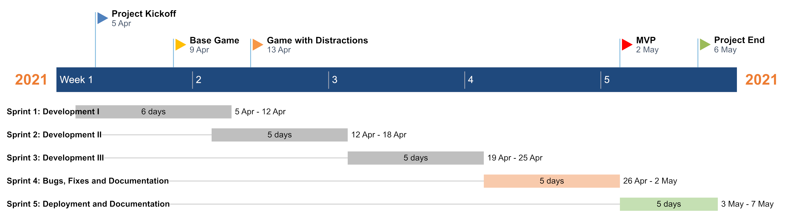

[&#8592; Back to Report Landing Page](../README.md)
# Sprints and Project Management
## Communication
### Overview
We spent weeks 1 - 5 (01/02 - 05/03) to absorb the content delivered in the technical and design workshops and implement the walkthroughs on our own machines. This gave us the necessary information to decide on which roles we would undertake during our sprints. Therefore, our communication during these five weeks was just limited to the Tuesday and Thursday SEGP workshop timeslots. 

### Week 6 onwards
From Week 6 onwards, we held standups on Mondays, Wednesdays, and Fridays at 10:00 AM. In addition, we used the design and technical workshops on Tuesdays and Thursdays to further discuss how we would go about integrating the week's material into our repository. 

The [meeting logs](../../Meetings/README.md) provide a top-level summary of all of our standups.

### Communication Channels
Microsoft Teams was the primary tool for our daily standups and workshops. 

We used Discord for our general day to day communication. The Discord server was split into channels to further streamline topics of discussion and are as follows:
- **#frontend** - updates and information regarding our front end
- **#backend** - updates and information regarding our front end
- **#techincal-issues** - used to resolve any technical issues our members had (i.e. docker commands etc.)
- **#meetups** - used for any changes to standup schedules, absences etc. 
- **#tutorials** - useful walkthroughs on the internet relevant to our project

  

  <em>Figure 1: Team discord server.</em>

## Agile Working
### Choice of Methodology
This first development decision we encountered as a team was to decide on an appropriate workflow methodology that best fit our experience as software developers and the requirements laid out in the brief.

The rationale and thought process behind this decision has been outlined below.
 
The two potential frameworks we considered for our project were:
1. Scrum
2. Waterfall model

First, let's look at an overview of these two models.

#### Scrum
Scrum is an agile software methodology that ditches the traditional linear, sequential approach in favour of an incremental, iterative one.

Instead of extensive planning and design up front, Scrum allows for changing requirements over time by using cross-functional teams – incorporating planners, designers, developers and testers – which work on successive iterations of the product over fixed time periods (timeboxes). The work is organised into a backlog that is prioritised in to exact priority order based on business (or user) value.

The goal of each iteration is to produce a working product, which can be demonstrated to stakeholders. Feedback can then be incorporated into the next or future iterations.

##### Pros:
- Working software is delivered much more quickly and successive iterations can be delivered frequently, at a consistent pace.
- Closer collaboration between developers and the business due to high transparency.
- Flexible to changes in requirements at any point of the process – even late in development.
- Suitable for continuous integration and deployment for live systems.

##### Cons:
- Scrum is often more difficult to understand than Waterfall – at least initially due to the spontaneity of sprint planning and execution.
- With the emphasis on building working software throughout, there can be a perception that documentation can sometimes be neglected &#8594; an issue we faced initially during our sprints.
- Scrum does not suit very large teams.
  

  

  <em>Figure 2: The Scrum workflow.</em>

#### Waterfall 
In the waterfall methodology, all the requirements gathering, and design work is done before any coding takes place. There are stages that deal with what you need to do before a project, during a start up phase, a planning phase, an execution phase, and a closing phase. They also then have a series of processes for managing work packages, exceptions, reporting, risks, and issues.

##### Pros:
- Potential issues that would have been found during development can be researched and bottomed out during the design phase. If appropriate meaning an alternate solution is selected before any code is written.
- The development process tends to be better documented since this methodology places greater emphasis on documentation like requirements and design documentation.
- The waterfall process is a linear one, therefore it is potentially easier to follow, which made it a very tempting option for us to adopt for this project.

##### Cons:
- The level of planning required to lay out the project in phases can prove to be daunting for inexperienced software development teams.
- Problems remain unnoticed until the project nears completion, which may turn out potentially expensive.
- Changes to requirements can’t easily be incorporated with the waterfall method and there are often laborious change control procedures to go through when this happens.
  

  

  <em>Figure 3: The Waterfall model.</em>

#### Evaluation
We then evaluated these frameworks against a set of factors critical to delivering our web application in the leanest and most efficient manner given the tight time schedule. A summary of these factors is presented below:

| Evaluation Criteria             | Waterfall                                                                                                                                                                          | Scrum                                                                                                                                                                                     |
| :------------------------------ | :--------------------------------------------------------------------------------------------------------------------------------------------------------------------------------- | :---------------------------------------------------------------------------------------------------------------------------------------------------------------------------------------- |
| Software Development Lifecycle | Divided into concrete phases with little to no room for maneuverability around the design documentation.                                                                           | Every sprint is essentially a development lifecycle making it a suitable choice for short, time critical projects.                                                                        |
| Planning                        | Extensive documentation required before the start of the project.                                                                                                                  | A backlog of tasks and user stories required that can be accomplished using scoping workshops, overhead is a lot less.                                                                    |
| Change Management               | Laborious, since this would warrant changes to be made in the design and planning documentation.                                                                                   | Changes can be introduced flexibly, even late in the cycle, because of the short-lived nature of sprints.                                                                                 |
| Stakeholder Collaboration       | After the requirements specification from the client, there is no collaboration until delivery of the first prototype of the product.                                              | Maximum client collaboration and intervention possible due to continuous delivery at the end of each sprint, suitable for the SEGP team to provide us continuous feedback on our product. |
| Issue Identification            | Due to the lack of iterative review, issues become apparent upon delivery of the first prototype to the client.                                                                    | Issues are identified during sprint reviews and can be rectified instantaneously.                                                                                                         |
| Scheduling                      | Given that meticulous planning is mandatory at the start if the project, this is a massive disadvantage to inexperienced teams as they are unable to estimate the effort required. | The short-lived nature of sprints provides invaluable insight into the abilities of team members early in the project, making scheduling a lot more accurate for future sprints.          |
| Team Size                       | Suitable for big teams.                                                                                                                                                            | Suitable for teams with 3-10 members.                                                                                                                                                     |

A big advantage of the Scrum framework is its iterative nature which would help us reflect on our abilities and rescope our project if necessary every sprint. Moreover, the relatively short development lifecycle of the Scrum framework had the potential to provide us with invaluable insight into the weaknesses in our workflows. The idea would be to identify these weaknesses early in the project, learn from them, and rectify them in time for the next sprint. 

Based on this information and the feature-centric, modular nature of the project brief, we decided to adopt a slightly modified version of the **scrum** methodology. The modification here is that we left a bit of room for user stories to be carried forward into the next sprint if need be, since it was unable to estimate the effort required for certain tasks given our inexperience as software developers.

A major factor in eliminating use of the Waterfall model for our project was the planning complexity required at the start of the project. We believed that the lack of experience would make it extremely difficult to implement this step. 

### Project Vision and Scoping

Given the tight schedule and open-endedness of the project, we had to scope our project to ensure that we could deliver a minimum viable product that conformed to the project brief. Our primary objectives were as follows:

| Primary Objectives                                                                                                            |       Status       |
| :---------------------------------------------------------------------------------------------------------------------------- | :----------------: |
| Build a basic, functioning prototype of a single page application using the MEAN stack.                                        | :white_check_mark: |
| Ensure that the web application strikes the right balance between serious and play.                                           | :white_check_mark: |
| Continuous integration using GitHub and Docker is to be used throughout the project.                                           | :white_check_mark: |
| The web application shall be a card matching game with two rounds consisting of a normal round and a round with distractions. | :white_check_mark: |
| The user of the application will be able to compare their scores after both rounds.                                           | :white_check_mark: |

Time-permitting, these were the secondary objectives:

| Secondary Objectives                                              |       Status       |
| :----------------------------------------------------------------- | :----------------: |
| The application shall be statically served on GitHub pages.        | :white_check_mark: |
| The application shall support user authentication using passwords. |        :x:         |

### User Story Creation

A key step in the scrum workflow is the ideation of the user stories necessary to deliver a minimum viable product (MVP). We believe that the following user stories were essential to do so:

| Code      | User Story                                                                                                                                             | Completed in                                                   |
| --------- | :----------------------------------------------------------------------------------------------------------------------------------------------------- | :------------------------------------------------------------- |
| **US001** | As a user, I want to be able to type out the web address and arrive on the welcome page of the website.                                                | [Sprint 1](#sprint-1-development-i-0504---1104)                |
| **US002** | As a user, I want to compare my score against other users of the game.                                                                                 | [Sprint 3](#sprint-3-development-iii-1904---2504)              |
| **US003** | As a user, I want to compare my score against my previous score.                                                                                       | [Sprint 3](#sprint-3-development-iii-1904---2504)              |
| **US004** | As a user, I want to be able to click on new game and be directed to the first round of the game.                                                      | [Sprint 1](#sprint-1-development-i-0504---1104)                |
| **US005** | As a user, I want to have a seamless user experience, with an uninterrupted game flow.                                                                 | [Sprint 4](#sprint-4-bugs-fixes-and-documentation-2604---0205) |
| **US006** | As a user, I want to play the game with distractions in the form of news headlines on the screen.                                                      | [Sprint 2](#sprint-2-development-ii-1204---1804)               |
| **US007** | As a user, I want to play the game with distractions in the form of sounds.                                                                            | [Sprint 2](#sprint-2-development-ii-1204---1804)               |
| **US008** | As a user, I want to login to the game with my email.                                                                                                  | [Sprint 3](#sprint-3-development-iii-1904---2504)              |
| **US009** | As a user, I want to understand what the point of the game is from within the application itself, without having to read the associated documentation. | [Sprint 4](#sprint-4-bugs-fixes-and-documentation-2604---0205) |

### Sprints
#### Overview
The standups and meeting logs for our sprints can be found [here](../../Meetings/README.md).

Essentially, the way we approached our sprints were as follows:
1. At the start of the week, the team would pick user stories and break that down into smaller subtasks and categorise them into front end, back end or devops tasks.
2. Every member would assume repsonsibility of these subtasks based on their expertise and role in the team, and branch off to work (pun absolutely intended).
3. During the week, daily standups would happen on MS Teams and verbal communication pertaining to issues/solutions would occur on the Discord server.
4. At the end of the week, the team would reconvene for a review of how the week's work went. Merge commits into the **dev** branch were made if the feature was deemed complete by all team members. If the user story implementation was incomplete, it would simply get carried forward to the next week.

  

  <em>Figure XX : Timeline of critical milestones in the project.</em>

#### Sprint 1: Development I (05/04 - 11/04)

##### Plan
1. Setup development environments on all team members' workstations and practice the continuous integration process (push / pull workflow) using our own feature branches.
2. Setup Jira to setup our scrum environment and document our sprints.
3. Create the first page of our web application (US001).
4. Create a first instance of the game on our website (US004).
5. Create a first draft of our data model and implement this in MongoDB (US002, US003).
6. Begin JavaScript and API tutorials.

##### Outcomes and Review
1. The use of Jira added unnecessary overhead to the project and was turning out cumbersome. We decided to use [GitHub projects](https://github.com/keane-fernandes/Group1Project/projects/1) to document our sprints based on the suggestion of Marceli.
2. All members were familiarised with the GitHub workflow to ensure continuous integration.
3. A first prototype for our card matching game was merged into the **dev** branch.
4. All members were able to build and serve the website on their local machines.
5. The team now had the required knowledge to implement design decisions keeping in mind API considerations. 
   
#### Sprint 2: Development II (12/04 - 18/04)

##### Plan
1. Setup docker, ensure docker-compose script is able to spin up containers and serve our web application.
2. Update the base game so that there is now a round two, where distractions in the form of news articles move across the screen as you play (US006).
3. Add distractions in the form of sounds to our most current version of the game based on feedback from our user surveys and background research (US007).
4. Setup the Express framework so that our front end can talk to our database (US002, US003, US008).

##### Outcomes and Review
1. Docker gave us some problems initially wherein our NodeJS container would keep restarting. This was fixed using this [shell script](../../site/wait-for.sh) and now continuous deployment was possible through docker containers.
2. The application of the overlay to the game screen proved quite challenging. However, it worked out in the end as game now had news article distractions pop up on the screen which was being pulled by an [external news API](https://newsapi.org).
3. The Express module was still a work in progress and was carried forward into the next sprint.

#### Sprint 3: Development III (19/04 - 25/04)
Based on the momentum and feedback from the development activities of last week's sprint we were coming closer to achieving a fully functional MVP. This week's sprint was critical in developing our API and integrating the frontend and backend.
##### Plan
1. Add navigation buttons on the website based on UX/UI design workshops.
2. Create the welcome page of our web application (US001).
3. Continue work on the API and ensures that it interfaces well with our front end and back end (US002, US003, US008, US009).

##### Outcomes and Review
1. The welcome page had been successfully created, although we did not been merge into **dev**. The merge was to be performed on the next sprint after it was more thoroughly tested for robustness.
2. The navigation buttons had also been successfully added, and further work was required on the backend to ensure that the buttons were fully functional.
3. We had a first working prototype of our API with more robustness testing to be performed in the next sprint.
   
#### Sprint 4: Bugs, Fixes and Documentation (26/04 - 02/05) 

##### Plan
1. Finalize the API.
2. Integrate welcome page, front end, back end and API. 
3. Initiate the project documentation process on GitHub.
4. Merge all features of the previous sprint and the work of this sprint into dev (welcome page, navigation buttons and API).
5. If the above four tasks are accomplished, we should have an MVP by the end of the sprint.

##### Outcomes and Review
1. The welcome page along with the navigation buttons were written in JavaScript, which caused a lot of issues during integration with the rest of the application. This was rectified by rewriting the components using TypeScript and remerging in dev.
2. The API was finalised, review and merged into dev.
3. The application was then tested using `ng serve` and `docker-compose up`, and worked as expected. At this point, we had a functioning minimum viable product.
4. The project documentation process was successfully initiated, with the report template and navigation links fully setup on GitHub.

#### Sprint 5: Deployment and Documentation (03/05 - 07/05)

##### Plan
1. Look at avenues to publicly serve our application using GitHub pages.
2. Finish up documentation, with submission on Thursday evening at the very latest.
3. Fix up any last-minute bugs, and merge into **master** as a release for project submission.

##### Outcomes and Review
1. [Ongoing, UPDATE]

## CI/CD Pipeline
### Continuous Integration with GitHub
Our team achieved continuous integration by adopting a fairly standard git workflow consisting of **production**, **staging**, **dev** and **feature** branches. 

The **dev** branch was essentially a working master branch where all of the team members would merge their feature branches. 

In the event of a new feature to be added, the relevant team member would perform the following standard workflow:
1. Branch off the most recent commit on the **dev** branch into a new **feature-branch**. 
2. Perform the necessary code commits and the tests needed to implement the feature. 
3. Conduct a review of this newly written code with the rest of the team at the next daily standup. 
4. Merge commit into the **dev** branch and repeat with the next feature.

At the end of each sprint, depending on if we collectively agreed that the current version of our product on the **dev** branch could be deployed as a fully functional product, we would then merge **dev** into **staging**.

The **staging** branch, as the name suggests, was used to stage potential releases of our web application. Our product would be manually tested here to ensure that it worked as expected after which it would be merged into **production** as a release. 

For the sake of completeness, it is important to mention that the **production** branch was reserved for fully tested and stable working releases of our web application. 

  
  
<em> Figure 4: Continuous integration using git.</em>

### Continuous Deployment with Docker
Docker was used for continuous deployment of our web application. 

## Team Contributions

Documentation contributions. [INSERT LINK HERE]

| Team Member          | Contribution            |
| :------------------- | :---------------------- |
| Joshua Robertson     | Front end, UX/UI Design |
| Alan Cen             | Back end                |
| Ella Gryf-Lowczowska | Front end, UX/UI Design |
| Efan Haynes          | API                     |
| Keane Fernandes      | Docker, Github          |

### Bibliography: Sprints and Project Management

&nbsp; V. Driessen, "Sucessful Git Branching Model", Git, 2010. Available: https://nvie.com/posts/a-successful-git-branching-model/ [Accessed: 20- Apr- 2021].

&nbsp; S. Paradkar, "A beginner's guide to everything DevOps", DevOps, 2020. Available: https://opensource.com/article/20/2/devops-beginners [Accessed: 20- Apr- 2021].

&nbsp; Guru99, "What is Waterfall Model in SDLC? Advantages & Disadvantages", Waterfall, 2018. Available: https://www.guru99.com/what-is-sdlc-or-waterfall-model.html [Accessed: 22- Apr- 2021].

&nbsp; Manifesto, "Comaring Project Management Methodologies", Management, 2018. Available: https://manifesto.co.uk/agile-vs-waterfall-comparing-project-management-methodologies/ [Accessed: 25- Apr- 2021].

---

  <b>Navigation:</b> 
  <a href="../03-UX-Design/README.md">&#8592; Previous Section: UX Design</a> |
  <a href="#sprints-and-project-management">&#8593; Back to the top</a> |
  <a href="../05-Evaluation/README.md">&#8594; Next Section: Evaluation</a> 

